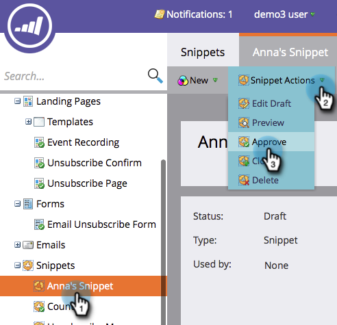

# Aprovar um snippet {#approve-a-snippet}

>[!PREREQUISITES]
>
>[Adicionar conteúdo a um trecho](/help/marketo/product-docs/personalization/segmentation-and-snippets/snippets/add-content-to-a-snippet.md)

Um trecho precisa ser aprovado antes do uso.

1. Vá para o **[!UICONTROL Design Studio]**.

   

1. Clique no seu **trecho**. Em **[!UICONTROL Ações de trecho]**, clique em **[!UICONTROL Aprovar]**.

   

Pronto! O status do seu trecho muda de Rascunho para Aprovado.

>[!MORELIKETHIS]
>
>[Aprovar um trecho sem rascunho](/help/marketo/product-docs/personalization/segmentation-and-snippets/snippets/approve-a-snippet-with-no-draft.md)
