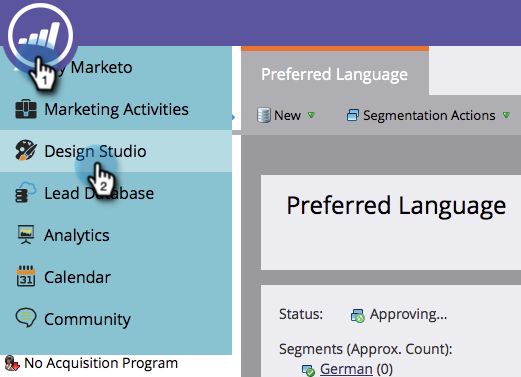

# Excluir um trecho {#delete-a-snippet}

>[!NOTE]
>
>**Pré-requisitos**
>
>* [Cancelar a aprovação de um trecho](unapprove-a-snippet.md)

>

Exclua um snippet de que você não precisa mais.

1. Vá para o **Design Studio.**

   

1. Vá para o snippet e, em **Snippet Actions (Ações** de trecho), clique em **Delete (Excluir**).

   

1. Clique em **Excluir **para confirmar ou apenas **Cancelar**.

   

   >[!NOTE]
   >
   >**Lembrete**
   >
   >
   >Você só pode excluir um fragmento que não esteja aprovado e não seja usado por nenhum ativo.

Concluído! Não é possível recuperá-la, portanto, antes de clicar no botão Excluir.
