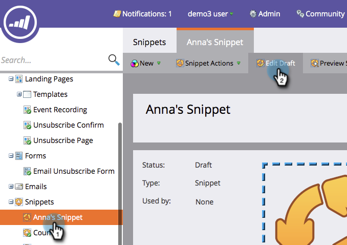

# Editar snippets com conteúdo dinâmico {#edit-snippets-with-dynamic-content}

>[!PREREQUISITES]
>
>* [Criar uma segmentação](/help/marketo/product-docs/personalization/segmentation-and-snippets/segmentation/create-a-segmentation.md)
>* [Criar um trecho](/help/marketo/product-docs/personalization/segmentation-and-snippets/snippets/create-a-snippet.md)

Use a Segmentação em trechos para gerenciar facilmente o conteúdo dinâmico em seus emails e landing pages.

## Adicionar segmentação {#add-segmentation}

1. Vá para o **[!UICONTROL Design Studio]**.

   

1. Clique no seu **trecho** e depois em **[!UICONTROL Editar rascunho]**.

   

1. Clique em **[!UICONTROL Segmentar por]**.

   

1. Insira **[!UICONTROL Segmentação]** e clique em **[!UICONTROL Salvar]**.

   

## Aplicar conteúdo dinâmico {#apply-dynamic-content}

1. Clique em um **Segmento** e edite o conteúdo. Repetir para cada segmento

   

>[!NOTE]
>
>Lembre-se de aprovar o trecho antes de usá-lo.

Não foi simples? Agora você está pronto para usar esses trechos em Emails e Landing Pages.

>[!MORELIKETHIS]
>
>* [Adicionar um trecho a um email](/help/marketo/product-docs/email-marketing/general/functions-in-the-editor/add-a-snippet-to-an-email.md)
>* [Adicionar um trecho a uma página de aterrissagem](/help/marketo/product-docs/demand-generation/landing-pages/personalizing-landing-pages/add-a-snippet-to-a-landing-page.md)
