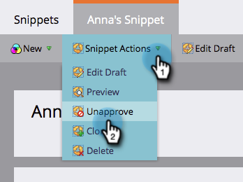

# Cancelar aprovação de um trecho {#unapprove-a-snippet}

Um trecho não aprovado não pode ser usado em emails ou landing pages.

1. Vá para o **Design Studio**.

   

1. Vá para o trecho e verifique se ele não é **Usado por** nenhum ativo.

   

   Se o trecho for usado por outros ativos, remova essas associações antes de continuar.

1. Em **Ações de Trecho**, clique em **Cancelar Aprovação**.

   

Pronto! O trecho está no status de rascunho agora para que você faça alterações ou exclua.
