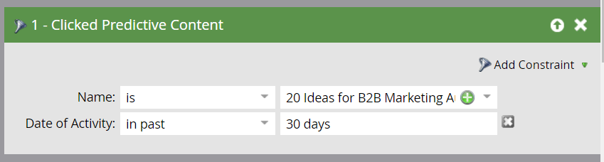

# Definir uma lista inteligente para atividades de conteúdo preditivo {#define-a-smart-list-for-predictive-content-activities}

Você pode usar atividades de conteúdo preditivo em acionadores e filtros ao definir uma lista inteligente em uma campanha inteligente. Você pode acionar uma ação para qualquer pessoa que clicar em conteúdo preditivo por meio do [modelo de Mídia Avançada](/help/marketo/product-docs/predictive-content/enabling-predictive-content/enable-predictive-content-for-web-rich-media.md), da [Barra de Recomendação de Conteúdo](/help/marketo/product-docs/predictive-content/enabling-predictive-content/enable-the-content-recommendation-bar.md) ou em um [email](/help/marketo/product-docs/predictive-content/enabling-predictive-content/enable-predictive-content-in-emails.md).

1. Na sua campanha inteligente, navegue até a guia **Lista inteligente**.

   

   >[!NOTE]
   >
   >As Smart Lists podem fazer coisas incríveis. Saiba mais na [lista inteligente detalhada](/help/marketo/product-docs/core-marketo-concepts/smart-campaigns/understanding-smart-campaigns.md).

1. Procure o acionador e, em seguida, arraste-o e solte-o na tela.

   

   >[!NOTE]
   >
   >Uma campanha inteligente com acionadores é executada no modo Acionador. Ele é executado em uma pessoa por vez com base nos eventos acionados e nos filtros adicionados.

1. Clique na lista suspensa **Nome** e selecione um operador.

   

1. Defina o acionador.

   

1. Adicione a restrição **Type**.

   

1. Selecione a origem necessária para a lista inteligente.

   

1. Se você estiver usando a fonte de email para seu conteúdo preditivo, adicione o acionador **Link de Cliques no Email**. Selecione seu email e adicione a restrição **É Preditivo**, definida como **true**.

   

1. Adicione outros filtros conforme necessário.

   

   >[!TIP]
   >
   >Em uma campanha inteligente com acionadores e filtros, os acionadores ficam no topo. Quando acionado, somente as pessoas que atendem aos critérios de filtro passam pelo fluxo.

   >[!NOTE]
   >
   >Com vários acionadores, uma pessoa passa para o fluxo se QUALQUER um dos acionadores for ativado.

   Para executar a campanha em um conjunto de pessoas ao mesmo tempo, saiba como [definir uma lista inteligente para uma campanha inteligente em lote](/help/marketo/product-docs/core-marketo-concepts/smart-campaigns/creating-a-smart-campaign/define-smart-list-for-smart-campaign-batch.md).

   >[!MORELIKETHIS]
   >
   >* [Definir lista inteligente para campanha inteligente | Lote](/help/marketo/product-docs/core-marketo-concepts/smart-campaigns/creating-a-smart-campaign/define-smart-list-for-smart-campaign-batch.md)
   >* [Adicionar uma Etapa de Fluxo a uma Campanha Inteligente](/help/marketo/product-docs/core-marketo-concepts/smart-campaigns/flow-actions/add-a-flow-step-to-a-smart-campaign.md)
   >* [Definir uma lista inteligente para atividades do Web Personalization](/help/marketo/product-docs/web-personalization/working-with-web-campaigns/define-a-smart-list-for-web-personalization-activities.md)
   >* [Habilitar Conteúdo Preditivo para Mídia Avançada na Web](/help/marketo/product-docs/predictive-content/enabling-predictive-content/enable-predictive-content-for-web-rich-media.md)
   >* [Habilitar a Barra de Recomendação de Conteúdo](/help/marketo/product-docs/predictive-content/enabling-predictive-content/enable-the-content-recommendation-bar.md)
