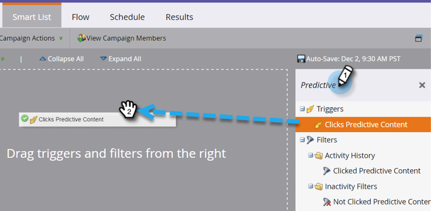

# Definir uma lista inteligente para atividades de conteúdo preditivo {#define-a-smart-list-for-predictive-content-activities}

Você pode usar atividades de conteúdo preditivo em acionadores e filtros ao definir uma lista inteligente em uma campanha inteligente. Você pode acionar uma ação para qualquer pessoa que clicar em conteúdo preditivo por meio da variável [Modelo de mídia avançada](/help/marketo/product-docs/predictive-content/enabling-predictive-content/enable-predictive-content-for-web-rich-media.md), o [Barra de recomendação de conteúdo](/help/marketo/product-docs/predictive-content/enabling-predictive-content/enable-the-content-recommendation-bar.md)ou em um [email](/help/marketo/product-docs/predictive-content/enabling-predictive-content/enable-predictive-content-in-emails.md).

1. Em sua campanha inteligente, navegue até o **Lista inteligente** guia .

   

   >[!NOTE]
   >
   >Listas inteligentes podem fazer coisas incríveis. Saiba mais na [mergulho profundo da lista inteligente](/help/marketo/product-docs/core-marketo-concepts/smart-campaigns/understanding-smart-campaigns.md).

1. Procure o acionador e arraste e solte-o na tela.

   

   >[!NOTE]
   >
   >Uma campanha inteligente com acionadores é executada no modo Acionador. Ele é executado em uma pessoa de cada vez com base nos eventos acionados e nos filtros adicionados.

1. Clique no botão **Nome** e selecione um operador.

   

1. Defina o acionador.

   

1. Adicione o **Tipo** restrição.

   

1. Selecione a fonte necessária para sua lista inteligente.

   

1. Se estiver usando a fonte de email para seu conteúdo preditivo, adicione o **Link de cliques no email** acionador. Selecione seu email e adicione o **É preditivo** restrição, definida como **true**.

   

1. Adicione outros filtros, conforme necessário.

   

   >[!TIP]
   >
   >Em uma campanha inteligente com acionadores e filtros, os acionadores ficam no topo. Quando acionado, somente as pessoas que atendem aos critérios de filtro passam pelo fluxo.

   >[!NOTE]
   >
   >Com vários acionadores, uma pessoa passa para o fluxo se QUALQUER um dos acionadores for ativado.

   Para executar a campanha em um conjunto de pessoas ao mesmo tempo, aprenda a [definir uma lista inteligente para uma campanha inteligente em lote](/help/marketo/product-docs/core-marketo-concepts/smart-campaigns/creating-a-smart-campaign/define-smart-list-for-smart-campaign-batch.md).

   >[!MORELIKETHIS]
   >
   >* [Definir Smart List para Smart Campaign | Lote](/help/marketo/product-docs/core-marketo-concepts/smart-campaigns/creating-a-smart-campaign/define-smart-list-for-smart-campaign-batch.md)
   >* [Adicionar uma etapa de fluxo a uma campanha inteligente](/help/marketo/product-docs/core-marketo-concepts/smart-campaigns/flow-actions/add-a-flow-step-to-a-smart-campaign.md)
   >* [Definir uma lista inteligente para atividades de personalização da Web](/help/marketo/product-docs/web-personalization/working-with-web-campaigns/define-a-smart-list-for-web-personalization-activities.md)
   >* [Ativar conteúdo preditivo para mídia avançada da Web](/help/marketo/product-docs/predictive-content/enabling-predictive-content/enable-predictive-content-for-web-rich-media.md)
   >* [Ativar a Barra de Recomendação de Conteúdo](/help/marketo/product-docs/predictive-content/enabling-predictive-content/enable-the-content-recommendation-bar.md)

