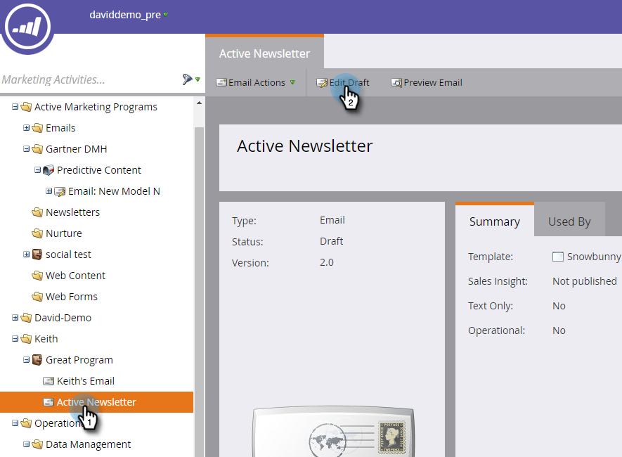

# Ativar conteúdo preditivo em emails {#enable-predictive-content-in-emails}

Torne uma ou mais imagens no seu email preditiva, adaptando a experiência para cada recipient.

>[!NOTE]
>
>Recomenda-se ativar mais de cinco partes de conteúdo por categoria e por origem (email, mídia avançada, barra) antes de testar e usar o Conteúdo preditivo. Mais conteúdo oferece um resultado preditivo melhor.

>[!PREREQUISITES]
>
>Antes de ativar o conteúdo preditivo, você deve:
>
>* **Preparar seu conteúdo preditivo**
>
>   * [Editar conteúdo preditivo para emails](/help/marketo/product-docs/predictive-content/working-with-predictive-content/edit-predictive-content-for-emails.md){target="_blank"} ou
>   * [Editar conteúdo preditivo para mídia avançada](/help/marketo/product-docs/predictive-content/working-with-predictive-content/edit-predictive-content-for-rich-media.md){target="_blank"} ou
>   * [Editar Conteúdo Preditivo para a Barra de Recomendação](/help/marketo/product-docs/predictive-content/working-with-predictive-content/edit-predictive-content-for-the-recommendation-bar.md){target="_blank"}
>
>* [Aprovar um Título para Conteúdo Preditivo](/help/marketo/product-docs/predictive-content/working-with-all-content/approve-a-title-for-predictive-content.md){target="_blank"}

## Adição de conteúdo preditivo usando o Editor de email 2.0 {#adding-predictive-content-using-the-email-editor}

1. Clique em **[!UICONTROL Atividades de marketing]**.

   

1. Selecione seu email e clique em **[!UICONTROL Editar Rascunho]**.

   

1. Clique na imagem que deseja tornar preditiva. Quando o ícone de engrenagem aparecer, clique nele e selecione **[!UICONTROL Habilitar ContentAI]** (ContentAI é o antigo nome do Conteúdo preditivo).

   

1. Para selecionar uma ou mais categorias, clique no menu suspenso **[!UICONTROL Categorias]**, faça sua(s) seleção(ões) e clique em **[!UICONTROL Aplicar]**.

   

   >[!NOTE]
   >
   >Escolher categorias específicas ou alterar o layout preditivo é opcional.

1. Sua imagem agora é preditiva. Repita as etapas 3 e 4 para imagens adicionais (se desejar).

   

1. Para visualizar seu email, clique em **[!UICONTROL Visualizar]** no canto superior direito.

   

1. Para exibir diferentes imagens possíveis, clique em **[!UICONTROL Atualizar]**.

   

   >[!NOTE]
   >
   >A imagem não é selecionada **_até que o destinatário abra o email_**. Portanto, o que você vê na visualização é apenas um exemplo e não será necessariamente a imagem que o recipient vê.

1. Quando terminar de visualizar seu email, clique no menu suspenso **[!UICONTROL Ações de Visualização]** e selecione **[!UICONTROL Aprovar e Fechar]**. Ou se ainda tiver que fazer edições, clique em **[!UICONTROL Editar rascunho]** à direita.

   

   >[!NOTE]
   >
   >Ao enviar uma amostra, uma imagem aleatória será selecionada.

Após aprovar seu email, ele será equipado com Conteúdo preditivo e pronto para ser enviado!

>[!CAUTION]
>
>Depois que um recipient abre o email, as imagens preditivas são bloqueadas. Se o conteúdo for removido posteriormente, os recipients verão uma imagem quebrada onde o conteúdo foi.

## Adicionar conteúdo preditivo quando o editor de email 2.0 não estiver sendo usado {#adding-predictive-content-when-not-using-the-email-editor}

Se você não estiver usando um modelo de [Email 2.0](/help/marketo/product-docs/email-marketing/general/email-editor-2/email-editor-v2-0-overview.md){target="_blank"}, a adição de Conteúdo preditivo ao email pode ser feita simplesmente marcando uma imagem no modelo como um elemento de imagem editável do Marketo.

Saiba mais sobre a [sintaxe específica do Marketo aqui](/help/marketo/product-docs/email-marketing/general/email-editor-2/email-template-syntax.md#elements){target="_blank"}.

Este é um exemplo de como o código deve parecer (este é apenas um exemplo, não copie o código abaixo exatamente).

**Exemplo**

```example
<div class="mktoImg" id="exampleImg" mktoName="Example Image" mktoImgLink="https://www.marketo.com">  
<a></a>  
</div>
```
