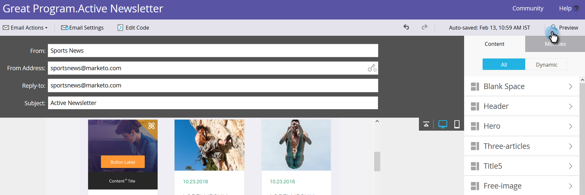

# Ativar conteúdo previsível em emails {#enable-predictive-content-in-emails}

Faça uma ou mais imagens em seu email preditivas, personalizando a experiência de cada recipient.

>[!NOTE]
>
>Recomenda-se ativar mais de cinco partes de conteúdo por categoria e por fonte (email, mídia avançada, barra) antes de testar e usar o Conteúdo preditivo. Mais conteúdo oferece um melhor resultado preditivo.

>[!PREREQUISITES]
>
>Antes de ativar o conteúdo preditivo. você deve:
>
>* [Preparar seu conteúdo preditivo](/help/marketo/product-docs/predictive-content/working-with-predictive-content/edit-predictive-content-for-emails.md)
>* [Aprovar um título para conteúdo previsível](/help/marketo/product-docs/predictive-content/working-with-all-content/approve-a-title-for-predictive-content.md)


## Adicionar conteúdo preditivo usando o Editor de e-mail 2.0 {#adding-predictive-content-using-the-email-editor}

1. Clique em **Atividades de marketing**.

   

1. Selecione seu email e clique em **Editar rascunho**.

   

1. Clique na imagem que deseja tornar preditiva. Quando o ícone de engrenagem for exibido, clique nele e selecione **Ativar conteúdo`AI`** (Conteúdo`AI` é o nome anterior para Conteúdo previsível).

   

1. Para selecionar uma ou mais categorias, clique no menu suspenso **Categoria**, faça suas seleções e clique em **Aplicar**.

   

   >[!NOTE]
   >
   >Escolher categorias específicas ou alterar o layout preditivo é opcional.

1. Sua imagem agora é preditiva. Repita as etapas 3 e 4 para obter imagens adicionais (se desejado).

   

1. Para pré-visualização de seu email, clique em **Pré-visualização** no canto superior direito.

   

1. Para visualização de diferentes imagens possíveis, clique em **Atualizar**.

   

   >[!NOTE]
   >
   >A imagem não é selecionada **_até que o recipient abra o e-mail_**. Então o que vocês veem na pré-visualização é apenas um exemplo, e não será necessariamente a imagem que o recipient vê.

1. Quando terminar de visualizar seu email, clique no menu suspenso **Ações de Pré-visualização** e selecione **Aprovar e Fechar**. Ou, se ainda tiver edição para fazer, clique em **Editar rascunho** à direita.

   

   >[!NOTE]
   >
   >Ao enviar uma amostra, uma imagem aleatória será selecionada.

Depois que você aprovar seu email, ele será equipado com Conteúdo previsível e pronto para ser enviado!

>[!CAUTION]
>
>Assim que um recipient abrir o email, as imagens preditivas serão bloqueadas. Se o conteúdo for removido posteriormente, os recipient verão uma imagem quebrada onde o conteúdo estava.

## Adicionar conteúdo preditivo quando não estiver usando o Editor de e-mail 2.0 {#adding-predictive-content-when-not-using-the-email-editor}

Se você não estiver usando um modelo de [Email 2.0](/help/marketo/product-docs/email-marketing/general/email-editor-2/email-editor-v2-0-overview.md), a adição de Conteúdo previsível ao seu email pode ser feita simplesmente marcando uma imagem no seu modelo como um elemento de imagem editável Marketo.

Saiba mais sobre a [sintaxe específica do Marketing aqui](/help/marketo/product-docs/email-marketing/general/email-editor-2/email-template-syntax.md#elements).

Este é um exemplo de como o código deve ser exibido (este é apenas um exemplo, não copie exatamente o código abaixo).

**Exemplo**

```example
<div class="mktoImg" id="exampleImg" mktoName="Example Image" mktoImgLink="http://www.marketo.com">  
<a></a>  
</div>
```
