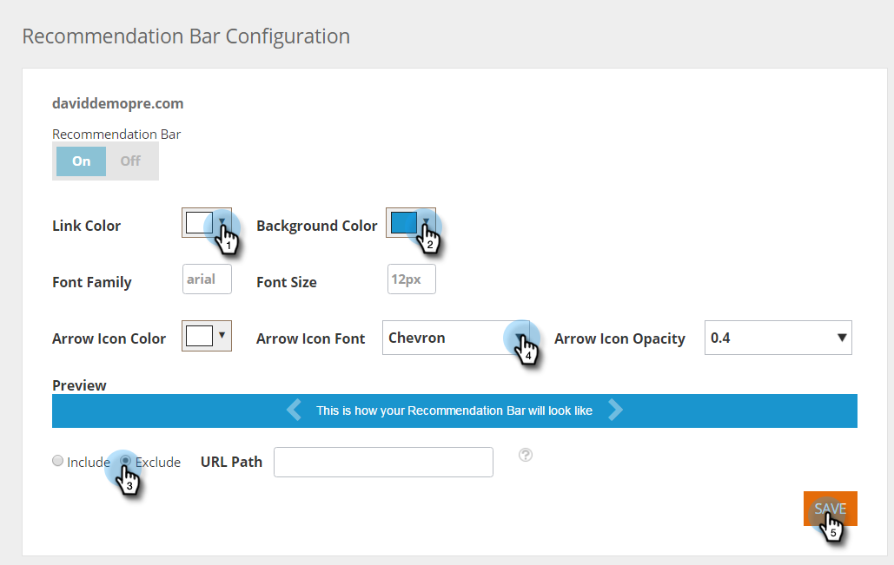

# Habilitar a barra de recomendação de conteúdo {#enable-the-content-recommendation-bar}

O Content Recommendation Engine usa análises preditivas e algoritmos de aprendizado de máquina para fornecer conteúdo relevante a cada visitante da Web. O mecanismo de recomendação prevê qual conteúdo teria melhor desempenho por visitante. O conteúdo do mecanismo é monitorado e controlado na página Recommendations, que ajuda a otimizar o ROI do conteúdo.

>[!PREREQUISITES]
>
>Antes de ativar o conteúdo preditivo, você deve:
>
>* **Preparar seu conteúdo preditivo**
>
>   * [Editar conteúdo preditivo para emails](/help/marketo/product-docs/predictive-content/working-with-predictive-content/edit-predictive-content-for-emails.md) ou
>   * [Editar conteúdo preditivo para mídia avançada](/help/marketo/product-docs/predictive-content/working-with-predictive-content/edit-predictive-content-for-rich-media.md) ou
>   * [Editar Conteúdo Preditivo para a Barra de Recomendação](/help/marketo/product-docs/predictive-content/working-with-predictive-content/edit-predictive-content-for-the-recommendation-bar.md)
>
>* [Aprovar um Título para Conteúdo Preditivo](/help/marketo/product-docs/predictive-content/working-with-all-content/approve-a-title-for-predictive-content.md)

## Ativar e personalizar a barra de recomendação de conteúdo {#enable-and-customize-the-content-recommendation-bar}

1. Vá para **[!UICONTROL Configurações de Conteúdo]**.

   

1. Clique em **[!UICONTROL Barra]**.

   

1. Para habilitar a Barra de Recomendações para uma URL, basta clicar em **[!UICONTROL Ligado]** e em **[!UICONTROL Salvar]**.

   

1. Para personalizar um URL, selecione cores, estilo, formato, setas para a barra de recomendações e páginas para incluir ou excluir a barra. Personalize para se adequar à marca do seu site. Clique em **[!UICONTROL Salvar]**.

   

   >[!NOTE]
   >
   >**Incluir / Excluir URL de Exibição**
   >
   >* O URL de exibição deve ser o caminho do domínio
   >* Não inclua https:// ou https://
   >* Usar &#42; para curingas
   >* Usar ponto e vírgula como separador
   >* Exemplo: /contact_us&#42;; &#42;action=logout&#42;
   >* Este campo diferencia maiúsculas de minúsculas

## Considerações sobre a Barra de Recomendações {#recommendation-bar-considerations}

* Você precisa de pelo menos um conteúdo para que a barra de recomendações seja definida como **[!UICONTROL Ativado]** na página Recomendações para que o mecanismo de Recomendação funcione. Se nenhum conteúdo estiver habilitado e a Barra estiver definida como **[!UICONTROL Ativada]**, o efeito de Seta será exibido na parte inferior direita da página da Web, mas nenhum conteúdo recomendado será exibido.

* Quanto mais conteúdo for executado no mecanismo de recomendação, melhor será para o algoritmo testar e saber qual conteúdo funciona melhor. Recomendamos começar com 10 a 20 partes de conteúdo em execução e ativas e continuar adicionando novas.
* A parte de conteúdo que você habilita para recomendação deve incluir a tag Javascript RTP. Isso ajuda o algoritmo a rastrear e otimizar o conteúdo recomendado.

>[!MORELIKETHIS]
>
>[Habilitar Conteúdo Preditivo para Mídia Avançada na Web](/help/marketo/product-docs/predictive-content/enabling-predictive-content/enable-predictive-content-for-web-rich-media.md)
