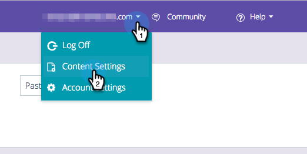

# Configurações da meta do algoritmo {#algorithm-goal-settings}

As Configurações de meta do algoritmo permitem definir a meta final do algoritmo de inteligência artificial de Conteúdo preditivo para alinhar-se às suas metas comerciais.

1. Em Conteúdo preditivo, clique no nome de logon e selecione **Configurações de conteúdo**.

   

1. Em Configurações de conteúdo, selecione **Algoritmo**.

   

1. Selecione uma meta para cada fonte de conteúdo preditivo para o algoritmo de IA para maximizar o desempenho do conteúdo.

   

   | **Cliques** | Mostrar o conteúdo com maior probabilidade de levar a pessoa que o visualiza a clicar nele |
   |---|---|
   | **Conversões** | Mostrar o conteúdo com maior probabilidade de levar a pessoa que o visualiza a enviar um formulário |

1. Clique em **Salvar** quando terminar.

   
