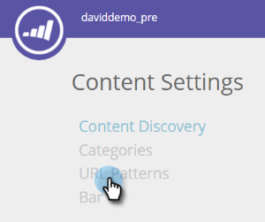

# Criar padrões de conteúdo {#create-content-patterns}

Quando você define padrões de conteúdo, o conteúdo é descoberto automaticamente quando um visitante da Web clica na página da Web do HTML relevante ao padrão de conteúdo. Ele é usado para adicionar páginas do HTML (publicações de blogs, comunicados de imprensa, artigos de notícias) como partes de conteúdo à página Todo o conteúdo. Quando a descoberta automática se baseia em padrões de conteúdo, ela descobre e rastreia páginas do HTML relacionadas ao padrão de URL definido quando um visitante da Web visualiza ou clica em um link para a página. Essa parte do conteúdo (o URL, o nome da página e os metadados, incluindo o URL da imagem e a descrição) é adicionada à página Todo o conteúdo para preparar conteúdo preditivo. Para a descoberta automática de outro conteúdo, como PDFs e vídeo incorporado, você precisa [habilitar a descoberta de conteúdo](/help/marketo/product-docs/predictive-content/getting-started/enable-content-discovery.md).

1. Vá para **[!UICONTROL Configurações de Conteúdo]**.

   

1. Clique em **[!UICONTROL Padrões de URL]**.

   

1. Clique em **+** para abrir uma linha onde você pode inserir suas informações.

   

1. Adicione a extensão de URL do domínio onde a página da Web existe. Selecione a categoria (por exemplo, [!UICONTROL Blog], [!UICONTROL Artigo], [!UICONTROL Data Sheet], [!UICONTROL Press Release]).

   

   >[!NOTE]
   >
   >Os itens na lista suspensa à direita refletem as categorias configuradas quando você [criou categorias](/help/marketo/product-docs/predictive-content/getting-started/set-up-categories.md).

1. Clique em **+** para adicionar outro caminho.

   

1. Adicione a extensão e a categoria para o caminho adicional e clique em **[!UICONTROL Salvar]**.

   

## Regras de padrões de conteúdo {#content-pattern-rules}

* Você pode usar um curinga em qualquer lugar em uma expressão (Exemplo: _domain.com/&#42;_, _domain.com/&#42;blog&#42;_)

* Recomendamos usar /&#42; no final de uma expressão para continuar a descoberta de padrões (Exemplo: _domain.com/blog/&#42;_ descobre todas as postagens na pasta Blog)
* Os padrões de conteúdo não diferenciam maiúsculas de minúsculas (Exemplo: _domain.com/Blog/&#42;_ descobre todas as páginas html em _domain.com/Blog_ e _domain.com/blog_)

* Os parâmetros de URL não são descobertos (isso evita descobrir vários itens com o mesmo URL de conteúdo, mas com parâmetros diferentes)

## Exemplos {#examples}

Para _domain.com_:

<table>
 <tbody>
  <tr>
   <th>Padrão de URL</th>
   <th>Resultado</th>
  </tr>
  <tr>
   <td>blog/*</td>
   <td>
Descobre todo o conteúdo que corresponde ao padrão domain.com/blog/:

domain.com/blog/5-top-tricks

domain.com/blog/2017/new-year-solutions

domain.com/Blog/3-best-recipes
</td>
  </tr>
  <tr>
   <td>artigo/2017/*</td>
   <td>
Descobre todo o conteúdo que corresponde ao padrão domain.com/article/2017/:

domain.com/article/2017/5-top-tricks
</td>
  </tr>
  <tr>
   <td></td>
   <td>
Descobre qualquer URL que contenha a palavra "folhas de dados":

domain.com/datasheets/5-top-tricks

domain.com/blog/5-top-datasheets
</td>
  </tr>
  <tr>
   <td>press-release</td>
   <td>
Somente uma página HTML com correspondência exata é descoberta:

domain.com/press-release
</td>
  </tr>
  <tr>
   <td colspan="1"> </td>
   <td colspan="1">
Se a expressão do URL estiver vazia, o padrão de URL descobrirá somente a página inicial:

domínio.com
</td>
  </tr>
 </tbody>
</table>
