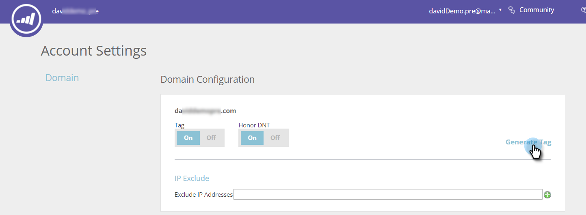

# Implantar o JavaScript para IA de conteúdo {#deploy-the-javascript-for-content-ai}

Para usar o Predictive Content, você precisa gerar e configurar a tag RTP (Web Personalization).

## Gerar tag {#generate-tag}

1. Faça logon na sua conta de conteúdo preditivo. Vá para **[!UICONTROL Configurações da conta]**.

   

1. Em **[!UICONTROL Configuração de Domínio]**, localize o domínio relevante e clique em **[!UICONTROL Gerar Marca]**.

   

1. Copie e cole a tag do Web Personalization na HTML do site.

   

   >[!NOTE]
   >
   >Copie a marca JavaScript do Web Personalization e cole-a como o primeiro script no cabeçalho de suas páginas, entre as marcas `<head> </head>`. Veja mais [instruções de implementação detalhadas aqui](/help/marketo/product-docs/web-personalization/rtp-tag-implementation/deploy-the-rtp-javascript.md).

1. Verifique se a tag é exibida em todas as páginas, incluindo páginas de aterrissagem e subdomínios. Verifique isso clicando com o botão direito do mouse na página do site. Vá para **[!UICONTROL Exibir Página Source]** em um navegador da Web. Pesquisa: &quot;RTP&quot;.

1. Confirme se o botão de alternância de Marca está definido como **[!UICONTROL ON]**.
