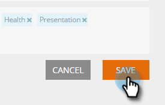

# Configurar Categoria {#set-up-categories}

Crie categorias em Conteúdo preditivo para agrupar seus resultados preditivos na Web ou no email. Por exemplo, você pode trabalhar somente com blogs ou com conteúdo em um idioma específico. Também permite pesquisar e filtrar a visualização da página.  As categorias são exibidas nas páginas Todo o conteúdo e Conteúdo previsível para facilitar a referência.

Ao editar o conteúdo descoberto, adicione categorias na tela de edição. Clique no campo **Categoria** e selecione-os no menu suspenso.

Ao adicionar conteúdo, você pode marcá-lo com categorias selecionadas no pop-up.

## Criar tags de Categoria {#create-category-tags}

Veja como criar tags de categoria.

1. Vá para **Configurações de conteúdo**.

   

1. Clique em **Categoria**.

   

1. Tags de categoria existentes são exibidas. Insira uma nova tag de categoria e clique em **Criar novo**.

   

1. Você pode remover uma tag de categoria clicando em **x** ao lado dela.

   

1. Clique em **Salvar** quando terminar.

   

   Muito simples.
