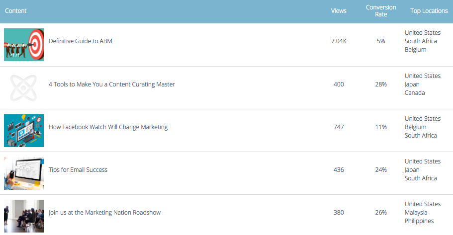

# Visão geral da análise de conteúdo preditivo {#predictive-content-analytics-overview}

Use a análise de conteúdo para obter mais insights sobre seu conteúdo existente, saber (com base em algoritmos de IA e Predictive) qual conteúdo funciona para seus públicos-alvo e aumentar o ROI de seus esforços de marketing.

>[!NOTE]
>
>A guia Analytics e os recursos de análise de conteúdo estão disponíveis exclusivamente com Conteúdo preditivo do Marketo.

## Visão geral {#overview}

Na página Resumo , clique em **Analytics**.

O Analytics inclui várias seções: Conteúdo principal por visualizações, Conteúdo principal por taxa de conversão, Conteúdo com tendência, Conteúdo sugerido e Conteúdo.

Passe o mouse sobre o ponto de interrogação em qualquer cabeçalho da seção para obter mais detalhes.

Clique no botão exportar para exportar os resultados dessa seção pelo Excel.

Você pode filtrar resultados por vários atributos/propriedades (por exemplo, Lista de contas ABM, País, etc.).

Clique no ícone de calendário para alterar as datas dos dados refletidos. Escolha uma quantidade predefinida de tempo ou um intervalo de datas específico.

## Principal conteúdo por exibições {#top-content-by-views}

Exibe as partes do conteúdo principal por número de visualizações por intervalo de datas selecionado.

## Principal conteúdo por taxa de conversão {#top-content-by-conversion-rate}

Exibe o conteúdo de conversão principal por taxa de conversão para o intervalo de datas selecionado.

>[!NOTE]
>
>**Definição**
>
>**Índice de conversão**: Uma porcentagem calculada pelas conversões diretas dividida por cliques.

## Conteúdo em alta {#trending-content}

Exibe o aumento de popularidade de uma peça de conteúdo, observando o último aumento de duas semanas nas visualizações em comparação ao mesmo período anterior.

## Conteúdo sugerido {#suggested-content}

Exibe o conteúdo que sugerimos que você promova em suas Atividades de marketing com base no filtro definido.

Passe o mouse sobre uma imagem no Conteúdo sugerido para revelar as opções disponíveis.

>[!NOTE]
>
>Vê esses ícones no fundo? Da esquerda para a direita estão: Exibir conteúdo, exportar para CSV, aprovar conteúdo.

## Conteúdo {#content}

Procure o conteúdo desejado e clique nele para ver detalhes adicionais, incluindo: os visitantes que a visualizam, novas versus recorrentes, conhecidas e anônimas, os principais locais de onde os visitantes vieram ao visualizar o conteúdo e os principais setores inferidos de onde eles vêm.

>[!NOTE]
>
>O &quot;Conteúdo semelhante&quot; baseia-se no conteúdo selecionado e é calculado por um algoritmo de regras de associação. Os resultados representam partes do conteúdo que os visitantes provavelmente clicarão, dependendo da peça selecionada e do comportamento passado do visitante. O filtro e o intervalo de datas não são levados em consideração.
