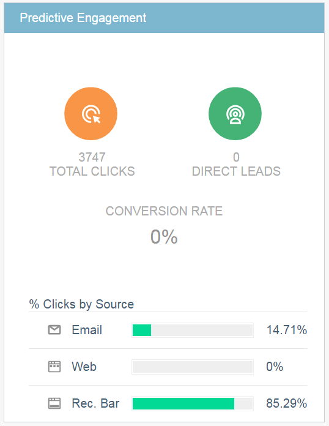
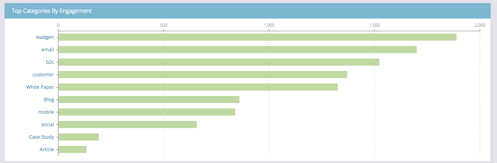

# O resumo do conteúdo preditivo {#the-predictive-content-summary}

O Resumo de conteúdo preditivo exibe as informações que você precisa sobre seu conteúdo preditivo rapidamente, com tabelas, gráficos e números atuais.

## Barra superior {#top-bar}

A barra superior mostra os números atuais de conteúdo e exibições e quantas partes estão habilitadas. Selecione uma visualização dos últimos 7 ou 30 dias para toda a página no canto superior direito.

## Tabela de desempenho {#performance-table}

Aqui você pode ver seus 10 principais conteúdos descobertos, incluindo visualizações, leads diretos e índice de conversão.

## Envolvimento previsível {#predictive-engagement}

Veja sua taxa de conversão comparando o total de cliques e leads diretos e compare o desempenho das diferentes fontes.

## Tendência de conteúdo por exibições  {#content-trend-by-views}

Compare como suas visualizações de todo o conteúdo correspondem ao seu conteúdo preditivo.

## Principais Categorias por Envolvimento {#top-categories-by-engagement}

Quais categorias de conteúdo são as mais envolventes? Veja neste gráfico.

>[!NOTE]
>
>Se você clicar em um link de categoria (exemplos na imagem acima: leads, email, etc.) ela abre a página Todo o conteúdo com a categoria em que você clicou adicionada ao filtro, exibindo a análise de conteúdo nessa categoria.
