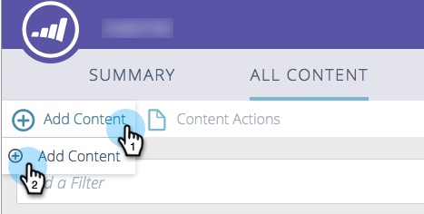

# Adicionar novo conteúdo {#add-new-content}

É possível adicionar conteúdo manualmente à página Todo o conteúdo com facilidade.

1. Clique no menu suspenso **Adicionar conteúdo** e selecione **Adicionar conteúdo**.

   

1. Insira um título e um URL, além de um URL de imagem, se necessário.

   

1. Para adicionar categorias, clique no campo e selecione no menu suspenso.

   

1. Clique em **Adicionar**.

   

1. O novo título agora aparece na página **Todo o Conteúdo**. Observe que ele ainda não foi aprovado para conteúdo preditivo.

   

1. Veja como adicioná-lo ao [Conteúdo preditivo](/help/marketo/product-docs/predictive-content/working-with-all-content/approve-a-title-for-predictive-content.md).
