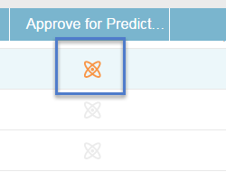

# Aprovar um título para conteúdo preditivo {#approve-a-title-for-predictive-content}

Você pode adicionar qualquer título em sua página [!UICONTROL Todo o Conteúdo] para conteúdo preditivo aprovando-o na página [!UICONTROL Todo o Conteúdo] ou na janela pop-up [!UICONTROL Editar Conteúdo].

## Página [!UICONTROL Todo o Conteúdo] {#all-content-page}

1. Marque a caixa ao lado do conteúdo.

   

1. Clique no menu suspenso **[!UICONTROL Ações de Conteúdo]** e selecione **[!UICONTROL Aprovar para Conteúdo Preditivo]**.

   

## Pop-up [!UICONTROL Editar Conteúdo] {#edit-content-pop-up}

Você também pode aprovar títulos para conteúdo preditivo diretamente no pop-up [!UICONTROL Editar conteúdo].

1. Passe o mouse sobre um conteúdo e clique no ícone de edição no final da linha.

   

1. Marque a caixa **[!UICONTROL Aprovar para Conteúdo Preditivo]** no pop-up [!UICONTROL Editar Conteúdo] e clique em **[!UICONTROL Salvar]**.

   

De qualquer forma que você use, o ícone [!UICONTROL Aprovar para conteúdo preditivo] agora aparece na linha.

E agora você pode ver o título exibido na página [!UICONTROL Conteúdo preditivo].

