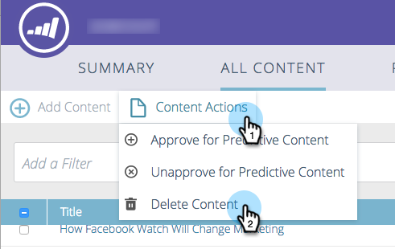

# Excluir conteúdo {#delete-content}

Quando você não precisa mais de um conteúdo, é fácil se livrar dele.

1. Marque a caixa ao lado do conteúdo que você deseja remover.

   

1. Clique no menu suspenso **[!UICONTROL Ações de Conteúdo]** e selecione **[!UICONTROL Excluir Conteúdo]**.

   
