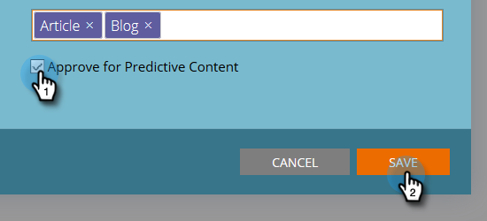

# Editar conteúdo {#edit-content}

É possível fazer algumas edições em listagens na Página de todo o conteúdo.

1. Na página **Todo o conteúdo**, passe o mouse sobre a linha do título que deseja editar e clique no ícone de edição.

   

1. Fazer alterações no Título do conteúdo e no URL do conteúdo (a caixa de seleção de parâmetros de consulta é opcional).

   

1. Clique no campo **Categorias** para adicionar/remover categorias. Selecione novos no menu suspenso. Você pode remover uma categoria atualmente selecionada clicando em seu **X**.

   

1. Marque a caixa **Aprovar para conteúdo preditivo** para aprovar ou desmarque a caixa para cancelar a aprovação. Clique em **Salvar** quando terminar.

   
