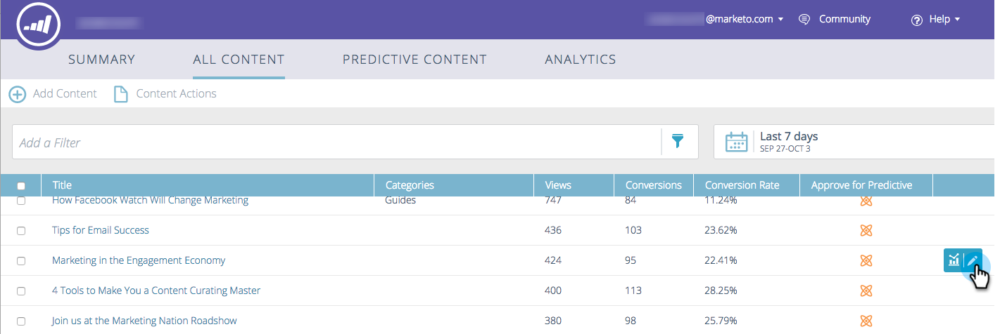

# Editar conteúdo {#edit-content}

Você pode fazer algumas edições nas listagens da página [!UICONTROL Todo o Conteúdo].

1. Na página **[!UICONTROL Todo o conteúdo]**, passe o mouse sobre a linha do título que deseja editar e clique no ícone de edição.

   

1. Faça alterações no [!UICONTROL Nome do Conteúdo] e na [!UICONTROL URL do Conteúdo] (a caixa de seleção de parâmetros de consulta é opcional).

   

1. Clique no campo **[!UICONTROL Categorias]** para adicionar/remover categorias. Selecione novos no menu suspenso. Você pode remover uma categoria atualmente selecionada clicando em seu **X**.

   

1. Marque a caixa **[!UICONTROL Aprovar para conteúdo preditivo]** para aprovar ou desmarque a caixa para cancelar a aprovação. Clique em **[!UICONTROL Salvar]** quando terminar.

   
