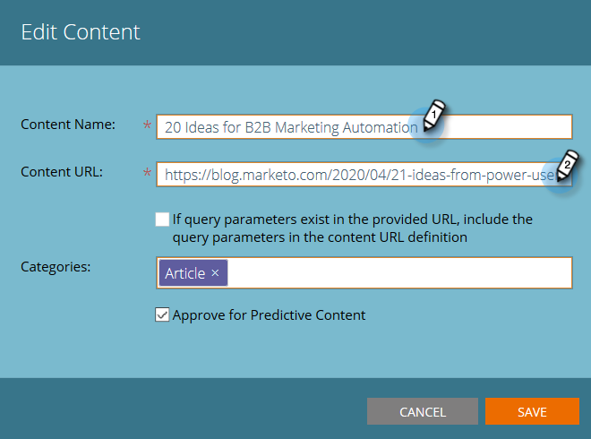

# Editar conteúdo {#edit-content}

É possível fazer algumas edições em listagens na página Todo o conteúdo .

1. No **Todo o conteúdo** passe o mouse sobre a linha do título que deseja editar e clique no ícone editar.

   

1. Faça alterações no Título do conteúdo e no URL do conteúdo (a caixa de seleção de parâmetros de consulta é opcional).

   

1. Clique no botão **Categorias** campo para adicionar/remover categorias. Selecione novos na lista suspensa. Você pode remover uma categoria selecionada no momento clicando em **X**.

   

1. Verifique a **Aprovar para conteúdo preditivo** para aprovar ou desmarque a caixa para cancelar a aprovação. Clique em **Salvar** quando concluído.

   
