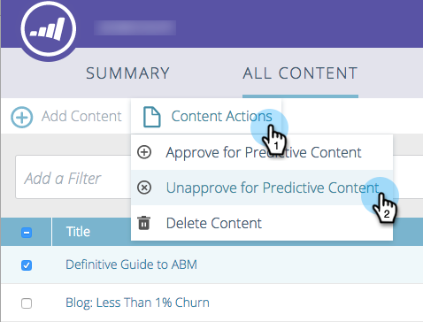
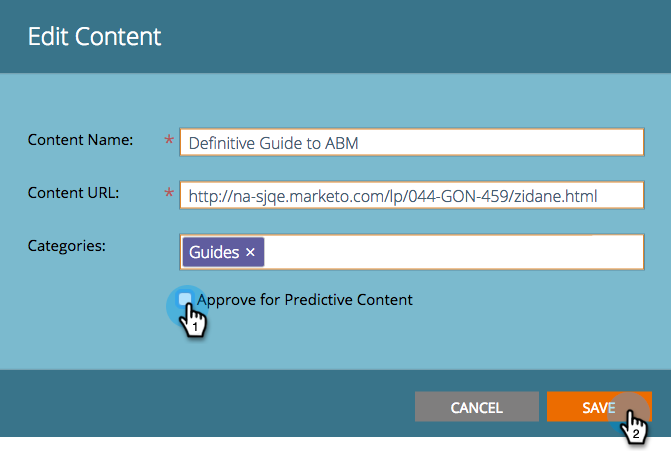

# Cancelar aprovação de um título para [!UICONTROL Conteúdo preditivo] {#unapprove-a-title-for-predictive-content}

Você pode cancelar a aprovação de qualquer título de conteúdo preditivo na página [!UICONTROL Todo o Conteúdo] ou na janela pop-up [!UICONTROL Editar Conteúdo].

## Página [!UICONTROL Todo o Conteúdo] {#all-content-page}

1. Na página [!UICONTROL Todo o conteúdo], marque a caixa ao lado do conteúdo para selecioná-lo.

   

1. Clique no menu suspenso **[!UICONTROL Ações de conteúdo]** e selecione **[!UICONTROL Cancelar aprovação para conteúdo preditivo]**.

   

## Pop-up [!UICONTROL Editar Conteúdo] {#edit-content-pop-up}

Você pode cancelar a aprovação de um título enquanto o edita.

1. Passe o mouse sobre um conteúdo e clique no ícone de edição no final da linha.

   

1. Desmarque a caixa **[!UICONTROL Aprovar para Conteúdo Preditivo]** e clique em **[!UICONTROL Salvar]**.

   

Independentemente do método usado, o ícone de aprovação desaparece na página [!UICONTROL Todo o Conteúdo] e o título desaparece da página [!UICONTROL Conteúdo Preditivo].

