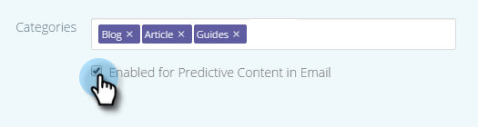

# Editar conteúdo preditivo para emails {#edit-predictive-content-for-emails}

Veja como configurar seu conteúdo preditivo para emails.

>[!PREREQUISITES]
>
>O conteúdo deve ser [aprovado para conteúdo preditivo](/help/marketo/product-docs/predictive-content/working-with-all-content/approve-a-title-for-predictive-content.md) na página [!UICONTROL Todo o Conteúdo].

1. Na página [!UICONTROL Conteúdo preditivo], clique em um título para abrir o editor.

   

1. A página de edição é aberta. O **[!UICONTROL Email]** é exibido por padrão.

   

   >[!NOTE]
   >
   >O título e o URL já estão preenchidos. Verifique se eles são o que você deseja.

1. Para adicionar/editar o rótulo do botão, digite na caixa de texto à direita.

   

   >[!NOTE]
   >
   >Se você alterou o rótulo do botão, ele será atualizado quando você salvar suas alterações ou visualizar sua imagem.

1. Para adicionar ou editar a URL da imagem, clique em **[!UICONTROL Editar Imagem]**.

   

   >[!CAUTION]
   >
   >Para garantir a melhor qualidade, a imagem deve ter 400x400 pixels ou menos.

1. Insira a URL da imagem e clique em **[!UICONTROL Adicionar]**.

   

1. Clique e arraste o controle deslizante para alterar o tamanho da imagem. Em seguida, clique e arraste a caixa de corte para isolar a área de imagem desejada. Clique em **[!UICONTROL Visualizar]** quando terminar.

   

1. Clique nas setas nas laterais para percorrer e visualizar o conteúdo em cada uma das visualizações do layout de email (duas opções são mostradas).

   |  |  |
   |---|---|

1. Opcionalmente, clique no campo **[!UICONTROL Categorias]** e adicione categorias ao conteúdo. As opções são das [categorias já configuradas](/help/marketo/product-docs/predictive-content/getting-started/set-up-categories.md).

   

1. Marque a caixa para ativar o Conteúdo preditivo no email.

   

1. Clique em **[!UICONTROL Salvar]**.

   

   >[!NOTE]
   >
   >No Marketo Email Editor v2.0, você também pode [exibir os modelos de layout](/help/marketo/product-docs/predictive-content/enabling-predictive-content/enable-predictive-content-in-emails.md) usados enquanto habilita o conteúdo.
