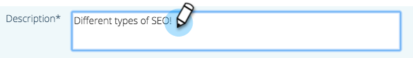

# Editar conteúdo preditivo para mídias avançadas {#edit-predictive-content-for-rich-media}

Veja como configurar seu conteúdo preditivo para Rich Media.

>[!PREREQUISITES]
>
>O conteúdo deve ser [aprovado para conteúdo preditivo](/help/marketo/product-docs/predictive-content/working-with-all-content/approve-a-title-for-predictive-content.md) na página Todo o conteúdo .

1. No **Conteúdo preditivo** clique em um título para abrir o editor.

   

1. Clique em **Mídia avançada**.

   

1. Você notará que pode ter imagens separadas para Email e Rich Media. Para adicionar/alterar a imagem, cole o URL da imagem em sua caixa de texto.

   

1. Digite uma **Descrição**.

   

1. Clique no botão **Categorias** caixa para selecionar/adicionar [categorias que você já configurou](/help/marketo/product-docs/predictive-content/getting-started/set-up-categories.md) (opcional).

   

   >[!NOTE]
   >
   >Use categorias para agrupar o conteúdo de um modelo de recomendação de Mídia avançada específico. Deixe a categoria em branco para aplicar o conteúdo a todos os templates de recomendação (recomendado).
   >
   >No entanto, se desejar recomendar apenas o conteúdo específico para um modelo de Mídia avançada, adicione uma categoria para o conteúdo e associe essa categoria ao modelo de recomendação.
   >
   >Por exemplo, categorize o conteúdo relevante de acordo com as seções do seu site (produtos ou soluções).

1. Marque a caixa para ativar Conteúdo preditivo em mídias avançadas.

   

1. Clique em **Salvar**.

   
