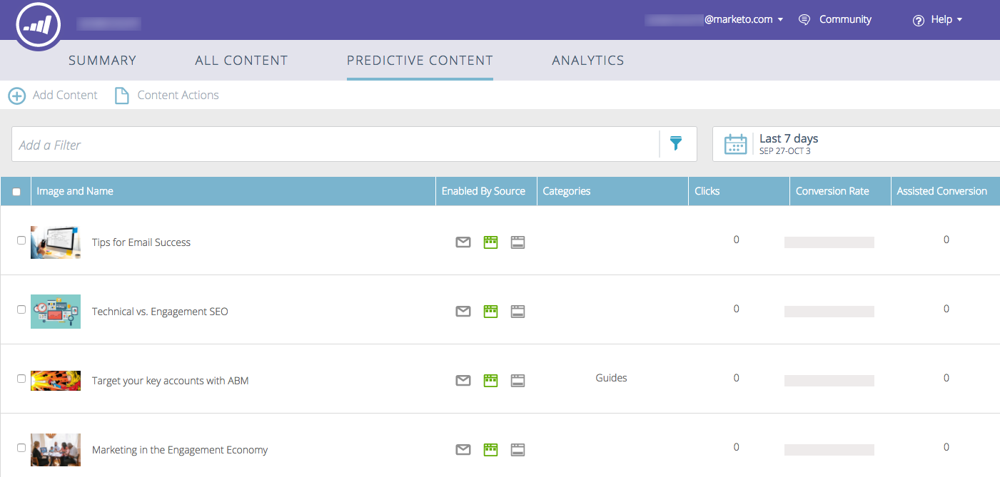

# Noções básicas sobre conteúdo preditivo {#understanding-predictive-content}

Depois de [aprovar um título para conteúdo preditivo](/help/marketo/product-docs/predictive-content/working-with-all-content/approve-a-title-for-predictive-content.md), você trabalha nele aqui. A página [!UICONTROL Conteúdo preditivo] exibe todos os títulos que você aprovou para conteúdo preditivo.

Os campos de página incluem:

* **[!UICONTROL Imagem e Nome]**: O nome do conteúdo e da imagem selecionada
* **[!UICONTROL Habilitado por Source]**: mostra se o título foi aprovado para Rich Media, email ou Barra de Recomendações.
* **[!UICONTROL Categorias]**: criadas por você e usadas para agrupar seus resultados preditivos para email ou Web
* **[!UICONTROL Cliques]**: total de cliques no conteúdo recomendado (incluindo todas as fontes)
* **[!UICONTROL Taxa de conversão]**: uma porcentagem calculada por conversões diretas divididas por cliques. Passe o mouse para ver dados adicionais (veja abaixo)
* **[!UICONTROL Conversão assistida]**: visitantes que clicaram no conteúdo recomendado em uma visita anterior e preencheram um formulário posteriormente

## Filtrar conteúdo {#filtering-content}

**[!UICONTROL Categoria]**

Você pode filtrar o conteúdo por categorias que criou. Clique no ícone de filtro e em **[!UICONTROL Categoria]**, selecione uma ou mais categorias de conteúdo.

**[!UICONTROL Source]** habilitada

Filtre por cada tipo de conteúdo habilitado: [!UICONTROL Email], [!UICONTROL Mídia Avançada], [!UICONTROL Barra de Recomendação].

**[!UICONTROL Análise por Source]**

A análise de conteúdo habilitada para filtragem oferece a capacidade de ver o desempenho de cada fonte.

## Exibir análises por data {#display-analytics-by-date}

1. selecione as datas de início e término à direita (como mostrado). Clique em **[!UICONTROL Aplicar]**.

   

## Exibir dados de tabela para conteúdo preditivo {#view-table-data-for-predictive-content}

Na tabela, é possível visualizar quais fontes estão ativadas para conteúdo preditivo, da esquerda para a direita: Barra de recomendação, email e Mídia avançada. As fontes ativadas são exibidas em verde. Você as ativa ao editar o conteúdo.

Passe o mouse sobre a barra na coluna [!UICONTROL Taxa de conversão] para exibir a taxa de conversão, a conversão direta e os dados clicados.

>[!NOTE]
>
>**Definições**
>
>**[!UICONTROL Taxa de conversão]**: uma porcentagem calculada por conversões diretas divididas por cliques
>
>**[!UICONTROL Conversão direta]**: visitantes que clicaram no conteúdo recomendado e concluíram um formulário na mesma visita
>
>**[!UICONTROL Clicou]**: total de cliques no conteúdo recomendado (incluindo todas as três fontes)
