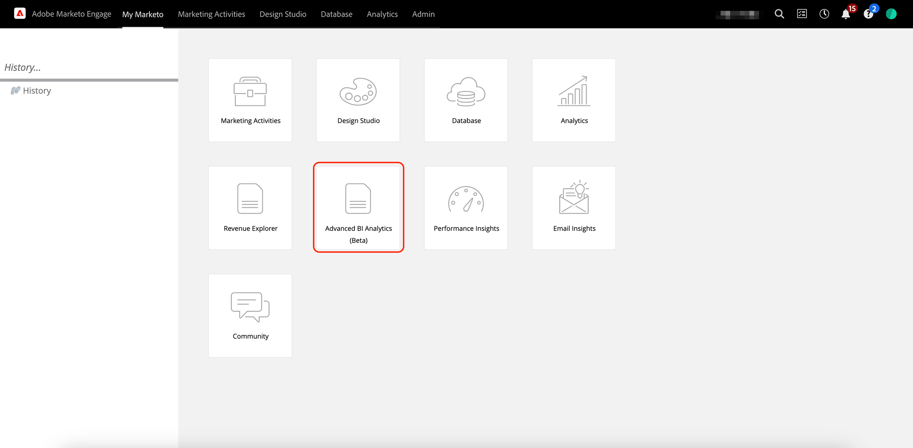

# Visão geral da análise de BI avançada {#advanced-bi-analytics-overview}

O Advanced BI Analytics (anteriormente conhecido como Revenue Explorer e Advanced Report Builder) oferece uma interface de relatório e visualização flexível nos dados do Marketo Engage, fornecendo detalhes detalhados sobre progressão, desempenho e muito mais. Ele oferece interatividade e visualização mais avançadas, desempenho mais rápido e uma experiência do usuário mais contínua e intuitiva.

Esses aprimoramentos ajudam você a economizar tempo, descobrir insights mais valiosos, impulsionar a otimização e compartilhar histórias de dados mais atraentes com colegas e partes interessadas.

>[!PREREQUISITES]
>
>Para acessar esse recurso, é necessário ter adquirido o complemento Advanced BI Analytics. Entre em contato com a equipe de conta da Adobe (seu gerente de conta) para obter mais detalhes.

## Principais recursos e benefícios {#key-features-and-benefits}

* **Mecanismo de consulta de alto desempenho**: proporciona um desempenho cinco vezes mais rápido em conjuntos de dados grandes, permitindo um processamento de dados mais rápido, carregamento de relatórios mais rápido e uma experiência analítica mais suave.

* **Visualização avançada e envolvente**: coleção ampla e expandida de opções de visualização integradas, incluindo gráficos, mapas e indicadores de KPI, que tornam os painéis mais reveladores e impactantes e melhoram significativamente a narrativa de dados.

* **Interatividade avançada e filtragem dinâmica**: aplique segmentações de dados dinâmicas, filtragem cruzada e filtros interdependentes em todos os visuais. Relatórios de várias páginas oferecem suporte a detalhamento, drill-up e drill-through avançados, garantindo uma exploração de dados sem esforço.

* **Interface intuitiva de criação de relatórios**: a experiência de apontar e clicar simplifica a criação de relatórios, incluindo relatórios de drill-through de várias páginas. A interface permite que os usuários criem relatórios complexos e interativos sem exigir uma grande experiência técnica.

* **Compartilhamento Fácil, Incluindo Exportação do PowerPoint**: a funcionalidade de compartilhamento integrada facilita o compartilhamento de insights. Entre outros destinos, os usuários podem gerar facilmente slides do PowerPoint prontos para apresentação.

## Criar um relatório {#create-a-report}

1. Em Meu Marketo, clique no bloco **[!UICONTROL Análise Avançada de BI]**.

   {width="800" zoomable="yes"}

1. Na guia **[!UICONTROL Relatórios]**, clique em **[!UICONTROL Criar relatório]**.

   {width="800" zoomable="yes"}

1. Selecione as medidas desejadas.

   {width="800" zoomable="yes"}

1. Selecione as dimensões desejadas.

   {width="800" zoomable="yes"}

1. Escolha sua visualização preferida.

   {width="800" zoomable="yes"}

1. Adicione filtros arrastando e soltando um atributo de dimensão.

   {width="800" zoomable="yes"}

## Exportar um relatório {#export-a-report}

Ao exportar um relatório completo, suas opções de exportação são PDF e PPT. Se você precisar de seus dados em .XLS ou .CSV, é possível fazer isso exportando visualizações individuais ([veja abaixo](#export-a-visualization)).

>[!BEGINTABS]

>[!TAB Na página Relatórios]

1. Na página Relatórios, clique no ícone &#39;mais&#39; (...) do relatório desejado e selecione **Exportar**.

   

1. Escolha PDF ou PPT e clique em **Exportar**.

   

>[!TAB No relatório]

1. No próprio relatório, clique no ícone &#39;mais&#39; (**...**) no canto superior direito e selecione **Exportar**.

   

1. Escolha PDF ou PPT e clique em **Exportar**.

   

>[!ENDTABS]

### Exportar uma visualização {#export-a-visualization}

Saiba como exportar seções específicas do relatório.

1. Escolha o relatório desejado.

   {width="600" zoomable="yes"}

1. Passe o mouse sobre a visualização exibida para revelar três ícones.

   {width="600" zoomable="yes"}

1. Clique no ícone &#39;mais&#39; (**`...`**)

   

1. Selecione **Exportar dados**.

   

1. Escolha o formato de dados desejado.

   

   >[!NOTE]
   >
   >* _Os dados com o layout atual_ só estão disponíveis para visuais de tabela e matriz.
   >* _Os dados subjacentes_ não estão disponíveis no Marketo Engage.

1. Escolha o formato de arquivo desejado (.XLS, .CSV).

   

1. Clique em **Exportar**.

## Vídeo de demonstração {#video}

Assista ao vídeo a seguir para ver um exemplo de uma experiência de relatório drill-through de várias páginas.

>[!VIDEO](https://video.tv.adobe.com/v/3451681/?quality=12&learn=on){transcript=true}

## Relatórios padrão no Advanced BI Analytics {#standard-reports}

Os seguintes relatórios padrão estão incluídos como exemplos para seus relatórios personalizados.

<table>
  <thead>
    <tr>
      <th>Área de relatório</th>
      <th>Nome do relatório</th>
    </tr>
  </thead>
  <tbody>
    <tr>
      <td rowspan="8">Análise de emails</td>
      <td>Email - Atividade enviada (em CST)</td>
    </tr>
    <tr>
      <td>Email - Atividade de cliques (em CST)</td>
    </tr>
    <tr>
      <td>Email - Abrir atividade (em CST)</td>
    </tr>
    <tr>
      <td>Email - Distribuição de tempo clicado (em CST)</td>
    </tr>
    <tr>
      <td>Email - Declínio da taxa de abertura</td>
    </tr>
    <tr>
      <td>Email - Distribuição de tempo aberto (em CST)</td>
    </tr>
    <tr>
      <td>Email - Detalhes de desempenho</td>
    </tr>
    <tr>
      <td>Email - Declínio da taxa de cliques</td>
    </tr>
    <tr>
      <td rowspan="8">Análise de leads</td>
      <td>As 10 Principais Fontes De Clientes Potenciais Por Clientes Potenciais Convertidos</td>
    </tr>
    <tr>
      <td>10 principais origens de leads</td>
    </tr>
    <tr>
      <td>Relatório de violações do SLA</td>
    </tr>
    <tr>
      <td>Relatório de Classificação por Vencimento do Cliente Potencial</td>
    </tr>
    <tr>
      <td>Relatório de Saldo de Cliente Potencial</td>
    </tr>
    <tr>
      <td>Relatório de conversão de clientes em potencial</td>
    </tr>
    <tr>
      <td>Relatório de Fluxo de Cliente Potencial</td>
    </tr>
    <tr>
      <td>Relatório de Tempo de Transição de Cliente Potencial</td>
    </tr>
    <tr>
      <td rowspan="5">Análise do programa</td>
      <td>Os 10 principais programas por sucesso</td>
    </tr>
    <tr>
      <td>Os 10 principais programas por pipeline total</td>
    </tr>
    <tr>
      <td>Relatório de Estágio de Receita do Programa</td>
    </tr>
    <tr>
      <td>Os 10 principais programas de aquisição</td>
    </tr>
    <tr>
      <td>Tendência de investimento do canal de marketing</td>
    </tr>
    <tr>
      <td rowspan="7">Análise de oportunidades</td>
      <td>Impacto de marketing em oportunidades fechadas</td>
    </tr>
    <tr>
      <td>Influência de Marketing em Oportunidades Fechadas Ganhas</td>
    </tr>
    <tr>
      <td>Influência de marketing nas oportunidades criadas</td>
    </tr>
    <tr>
      <td>(FT) Influência da comercialização nas oportunidades criadas</td>
    </tr>
    <tr>
      <td>(MT) Influência de marketing sobre oportunidades fechadas conquistadas</td>
    </tr>
    <tr>
      <td>(MT) Influência de marketing nas oportunidades criadas</td>
    </tr>
    <tr>
      <td>(FT) Influência de marketing em oportunidades conquistadas fechadas</td>
    </tr>
    <tr>
      <td>Análise de lead da oportunidade</td>
      <td>Os 10 Principais Proprietários Por Oportunidades Ganhas</td>
    </tr>
  </tbody>
</table>

## Itens a serem observados {#note}

* Seus relatórios personalizados foram replicados da experiência clássica para a nova experiência com as alterações de comportamento notáveis mencionadas na seção [Aprendendo a nova experiência](#learning-the-new-experience) abaixo.
* Os painéis na experiência clássica não eram transferíveis e exigiam recriação na nova experiência. Eles podem ser recriados como relatórios na nova experiência, e os filtros na nova experiência extrai automaticamente os valores possíveis.

  >[!NOTE]
  >
  >O painel da nova experiência do é apenas uma coleção de relatórios em uma única página. O principal valor do painel na nova experiência do é permitir que você apresente insights analíticos em diferentes áreas de relatórios.

* Você pode criar **até 700 relatórios** no Advanced BI Analytics.

  >[!NOTE]
  >
  >Se você tinha mais de 700 relatórios no Gerenciador de receita, alguns relatórios foram combinados com outros e consolidados por meio de páginas no relatório.
  >
  >* Se um relatório tinha uma assinatura de email, ele não era combinado.
  >* O restante dos relatórios na _mesma pasta_ foram combinados em um ou mais relatórios, por área de relatórios. Se houver mais de cinco relatórios para a área de relatórios, eles serão consolidados em mais de um relatório combinado.
  >* Cada relatório combinado tem no máximo cinco páginas.

* Há uma limitação de 1 milhão de linhas por query em qualquer visualização fornecida. Se a sua consulta exceder esse limite, você receberá o seguinte erro: `The resultset of a query to external data source has exceeded the maximum allowed size of '1000000' rows`. Para corrigir isso, reduza o intervalo de datas e/ou ajuste os filtros no relatório para reduzir o número de linhas no resultado do query.

## Aprendendo a nova experiência {#learning-the-new-experience}

A nova experiência de visualização é fornecida por meio do serviço Power BI incorporado.

Para obter um tutorial rápido sobre a experiência de visualização, visite o [Use visuais na documentação do Power BI](https://learn.microsoft.com/en-us/training/modules/visuals-in-power-bi/){target="_blank"} da Microsoft. Observe que talvez você não veja todos esses recursos no Marketo Engage.

### Alterações importantes na experiência {#notable-experience-changes}

A seguir estão as alterações na nova experiência (Advanced BI Analytics) da experiência clássica (Revenue Explorer/Advanced Report Builder).

* O filtro do tipo data funciona de forma equivalente; no entanto, a sintaxe para especificar valores foi alterada. Nos relatórios personalizados existentes, todos os valores de filtro do tipo data, exceto o &quot;Dia da semana&quot;, são convertidos automaticamente para seus equivalentes correspondentes na nova experiência do. O suporte para valores de &quot;Dia da semana&quot; foi descontinuado.

* Os filtros do tipo string agora fazem distinção entre maiúsculas e minúsculas.

* A assinatura de email inclui a exportação do PDF em vez da HTML do relatório. A nova assinatura de email não inclui a definição de relatório.

* No momento, não há suporte para deep link de relatório.

>[!NOTE]
>
>Não é possível incluir mais de um campo Grupo de campos personalizado em um visual para a área de relatório Análise de desempenho de modelo (clientes potenciais).

>[!MORELIKETHIS]
>
>[Métricas e dimensões](/help/marketo/product-docs/reporting/advanced-bi-analytics/metrics-and-dimensions.md){target="_blank"}
