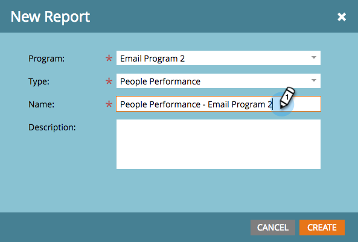

# Criar um relatório em um programa {#create-a-report-in-a-program}

Execute um relatório para analisar pessoas, seus programas, landing pages, emails e ativos sociais.

1. Vá para **[!UICONTROL Atividades de marketing]**.

   

1. Selecione um programa.

   

   >[!NOTE]
   >
   >Você também pode criar relatórios na guia **[!UICONTROL Analytics]**.

1. Clique com o botão direito no programa e selecione **[!UICONTROL Novo ativo local]**.

   

1. Clique em **[!UICONTROL Relatório]**.

   

1. Selecione o relatório **[!UICONTROL Type]**.

   

   >[!TIP]
   >
   >Consulte [Visão geral do tipo de relatório](https://docs.marketo.com/display/DOCS/Report+Type+Overview) para obter uma breve descrição de cada um.

1. Dê um nome ao seu relatório.

   

   >[!TIP]
   >
   >Para facilitar muito a navegação dos relatórios posteriormente, inclua uma referência ao tipo de relatório no nome.

1. Defina o período do seu relatório. Consulte [Alterar um intervalo de tempo do relatório](/help/marketo/product-docs/reporting/basic-reporting/editing-reports/change-a-report-time-frame.md) para obter mais detalhes.

1. Clique na guia **[!UICONTROL Relatório]** para ver suas estatísticas.

   

   >[!NOTE]
   >
   >Por padrão, os relatórios cobrem todas as atividades na sua conta, entre programas.

   >[!NOTE]
   >
   >Você pode rapidamente acabar com muitos relatórios. Lembre-se de [excluir um relatório](/help/marketo/product-docs/reporting/basic-reporting/report-activity/delete-a-report.md) que não é mais necessário.

   >[!MORELIKETHIS]
   >
   >Você pode [alterar um período de tempo do relatório](/help/marketo/product-docs/reporting/basic-reporting/editing-reports/change-a-report-time-frame.md), [assinar um relatório básico](/help/marketo/product-docs/reporting/basic-reporting/report-subscriptions/subscribe-to-a-basic-report.md), [exportar um relatório para o Excel](/help/marketo/product-docs/reporting/basic-reporting/report-activity/export-a-report-to-excel.md), [filtrar pessoas em um relatório com uma lista inteligente](/help/marketo/product-docs/reporting/basic-reporting/editing-reports/filter-people-in-a-report-with-a-smart-list.md) e muito mais.
