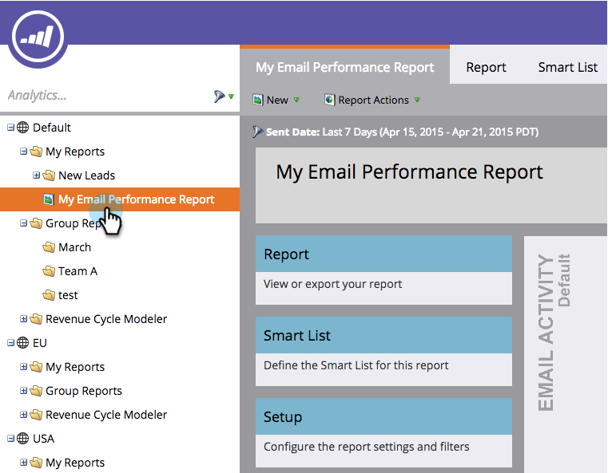

# Salvar um relatório {#save-a-report}

Às vezes, pode ser necessário salvar um relatório padrão para visualizá-lo novamente mais tarde. Veja como fazer isso:

1. Vá para a área **[!UICONTROL Analytics]**.

   

1. Selecione um [tipo de relatório](/help/marketo/product-docs/reporting/basic-reporting/report-types/report-type-overview.md).

   

1. Clique em **[!UICONTROL Ações de Relatório]** e selecione **[!UICONTROL Salvar como]**.

   

1. **[!UICONTROL Salve em]** um local e selecione uma **[!UICONTROL Pasta]**.

   

1. **[!UICONTROL Nomeie]** o relatório e clique em **[!UICONTROL Salvar]**.

   

   Legal! O relatório salvo agora aparecerá na árvore.

   

>[!MORELIKETHIS]
>
>Saiba como [clonar um relatório para agrupar relatórios](/help/marketo/product-docs/reporting/basic-reporting/report-activity/clone-a-report-to-group-reports.md).
