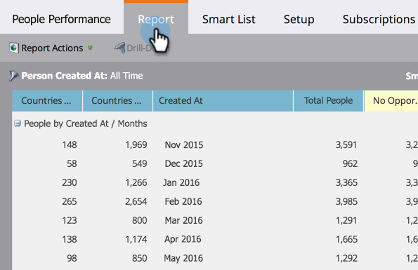

# Adicionar colunas personalizadas a um relatório de pessoas {#add-custom-columns-to-a-person-report}

Você pode filtrar ainda mais as métricas em seus relatórios de pessoa usando suas [listas inteligentes](/help/marketo/product-docs/core-marketo-concepts/smart-lists-and-static-lists/understanding-smart-lists.md) como colunas personalizadas.

1. Vá para a área **[!UICONTROL Atividades de marketing]** (ou **[!UICONTROL Analytics]**).

   

1. Selecione seu relatório e clique na guia **[!UICONTROL Configuração]**.

   

1. Arraste mais de **[!UICONTROL Colunas personalizadas]**.

   

1. Selecione as smart lists a serem usadas como colunas de relatório.

   

1. Você conseguiu! Clique na guia **[!UICONTROL Relatório]** para ver seu relatório com as novas colunas.

   

   >[!MORELIKETHIS]
   >
   >Você também pode [Adicionar Colunas de Oportunidade a um Relatório de Cliente Potencial](/help/marketo/product-docs/reporting/basic-reporting/editing-reports/add-opportunity-columns-to-a-lead-report.md).
