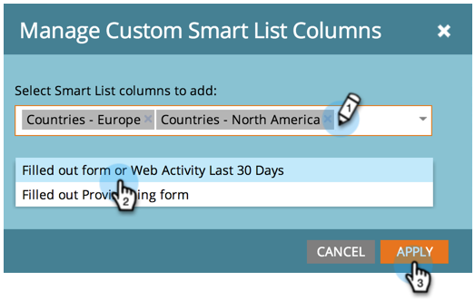

# Adicionar colunas personalizadas a um relatório de pessoas {#add-custom-columns-to-a-person-report}

Você pode filtrar ainda mais as métricas nos relatórios de pessoa usando [listas inteligentes](/help/marketo/product-docs/core-marketo-concepts/smart-lists-and-static-lists/understanding-smart-lists.md) como colunas personalizadas.

1. Vá para o **Atividades de marketing** ou **Analytics**).

   

1. Selecione seu relatório e clique no botão **Configuração** guia .

   

1. Arrastar sobre **Colunas personalizadas**.

   

1. Selecione as listas inteligentes a serem usadas como colunas de relatório.

   

1. Você fez isso! Clique no botão **Relatório** para ver seu relatório com as novas colunas.

   

   >[!MORELIKETHIS]
   >
   >Você também pode [Adicionar colunas de oportunidade a um relatório de oportunidade potencial](/help/marketo/product-docs/reporting/basic-reporting/editing-reports/add-opportunity-columns-to-a-lead-report.md).
