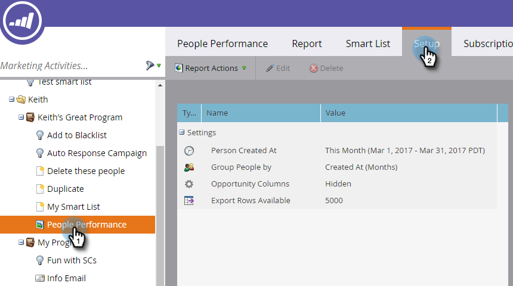
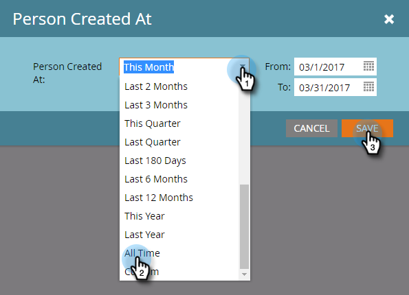

# Alterar um intervalo de tempo do relatório {#change-a-report-time-frame}

Altere o período coberto pelo relatório para se concentrar em um momento específico de atividade.

1. Vá para a área **[!UICONTROL Atividades de marketing]** (ou **[!UICONTROL Analytics]**).

   

1. Selecione seu relatório na árvore de navegação e clique na guia **[!UICONTROL Configuração]**.

   

1. Clique duas vezes no campo de intervalo de tempo, rotulado de forma diferente dependendo do tipo de relatório:

   * **[!UICONTROL Pessoa criada às]**, em relatórios pessoais
   * **[!UICONTROL Data de Envio]**, em relatórios de email
   * **[!UICONTROL Data da atividade]**, em todos os outros relatórios

   

   >[!NOTE]
   >
   >**[!UICONTROL Pessoa Criada às]** refere-se ao momento em que a pessoa ficou conhecida em seu banco de dados.

1. Escolha o intervalo de tempo apropriado no menu suspenso.

   

   >[!TIP]
   >
   >Para definir datas específicas, selecione **[!UICONTROL Personalizado]** no menu suspenso e insira as datas nos campos de calendário **[!UICONTROL De]** e **[!UICONTROL Até]**.

   Clique na guia **[!UICONTROL Relatório]** para ver seu relatório para o intervalo de tempo selecionado.
   

   >[!MORELIKETHIS]
   >
   >Para limitar seu relatório por atributos de pessoa específicos, você pode [Filtrar Pessoas em um Relatório com uma Smart List](/help/marketo/product-docs/reporting/basic-reporting/editing-reports/filter-people-in-a-report-with-a-smart-list.md).
