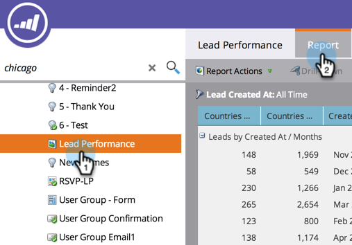

# Reordenar colunas do relatório {#reorder-report-columns}

Você pode alterar a ordem das colunas em um relatório.

1. Vá para a área **[!UICONTROL Atividades de marketing]** (ou **[!UICONTROL Analytics]**).

   

1. Selecione seu relatório na árvore de navegação e clique na guia **[!UICONTROL Relatório]**.

   

1. Clique e mantenha pressionada a coluna para arrastá-la até a nova posição e, em seguida, solte o botão do mouse.

   

1. Pronto! As colunas agora aparecem na nova ordem.

   

   Você pode repetir essas etapas até que as colunas apareçam na ordem que funciona melhor para você.

   >[!MORELIKETHIS]
   >
   >[Selecionar Colunas de Relatório](/help/marketo/product-docs/reporting/basic-reporting/editing-reports/select-report-columns.md)
