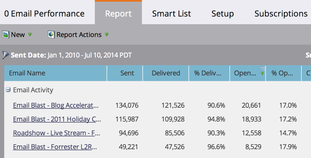

# Classificar Relatório em Colunas {#sort-report-on-columns}

Use colunas para classificar os dados no relatório e facilitar a localização dos números mais importantes.

1. Vá para **Analytics** (ou **Atividades de marketing**).

   

1. Selecione seu relatório na árvore de navegação e clique na guia **Relatório**.

   

1. Clique na coluna mais importante e selecione uma ordem de classificação.

   

1. Ótimo! Agora você pode se concentrar nos dados mais interessantes no seu relatório.

   

   >[!MORELIKETHIS]
   >
   >[Selecionar Colunas de Relatório](/help/marketo/product-docs/reporting/basic-reporting/editing-reports/select-report-columns.md)
