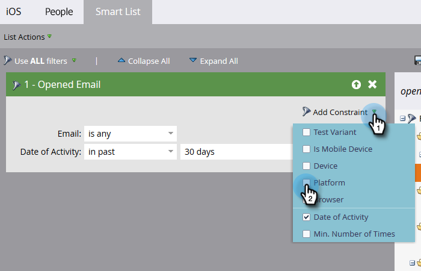

# Criar um relatório de desempenho de pessoas com colunas da plataforma móvel {#build-a-people-performance-report-with-mobile-platform-columns}

Siga estas etapas para criar um Relatório de desempenho de pessoas com colunas da plataforma móvel (iOS/Android).

## Criar listas inteligentes para dispositivos móveis {#create-mobile-smart-lists}

1. Vá para **[!UICONTROL Atividades de marketing]**.

   

1. Escolha um programa.

   

1. Em **[!UICONTROL Novo]**, selecione **[!UICONTROL Novo ativo local]**.

   

1. Clique em **[!UICONTROL Smart List]**.

   

1. Digite um nome e clique em **[!UICONTROL Criar]**.

   

1. Localize e arraste o filtro [!UICONTROL Email aberto] para a tela.

   

1. Definir Email como **[!UICONTROL é qualquer]**.

   

1. Clique em **[!UICONTROL Adicionar restrição]** e selecione **[!UICONTROL Plataforma]**.

   

   >[!TIP]
   >
   >Usamos o filtro [!UICONTROL Emails abertos] neste exemplo. Você também pode usar o filtro [!UICONTROL Email clicado], pois ele tem a restrição Plataforma.

1. Defina [!UICONTROL Plataforma] como **[!UICONTROL iOS]**.

   

   >[!NOTE]
   >
   >Pelo menos uma pessoa deve ter aberto um de seus emails em um dispositivo iOS para que a sugestão automática do Marketo possa encontrá-lo. Se ele não aparecer, digite-o manualmente e salve.

   Agora crie uma segunda lista inteligente para a plataforma &quot;Android&quot;. Depois disso, vá para a próxima seção.

## Criar um Relatório de Desempenho de Pessoas {#create-a-people-performance-report}

1. Em Atividades de marketing, selecione o programa que está hospedando suas listas inteligentes do **[!UICONTROL iOS]** e do **[!UICONTROL Android]**.

   

1. Em **[!UICONTROL Novo]**, selecione **[!UICONTROL Novo ativo local]**.

   

1. Clique em **[!UICONTROL Relatório]**.

   

1. Defina o Tipo como **[!UICONTROL Desempenho de pessoas]**.

   

1. Clique em **[!UICONTROL Criar]**.

   

   Você está indo muito bem! Agora, vamos para a próxima seção.

## Adicionar Smart Lists para dispositivos móveis como colunas {#add-mobile-smart-lists-as-columns}

1. No relatório que acabou de criar, clique em **[!UICONTROL Configurar]** e arraste **[!UICONTROL Colunas personalizadas]** para a tela.

   

   >[!NOTE]
   >
   >Por padrão, o relatório de desempenho de pessoas está analisando os Últimos 7 dias. Você pode alterar o período de tempo clicando duas vezes nele.

1. Localize e selecione as listas inteligentes criadas anteriormente e clique em **[!UICONTROL Aplicar]**.

   

1. Clique em **[!UICONTROL Relatório]** para executar o relatório e ver seus dados.

   

   Muito legal, não é? Muito bem!
