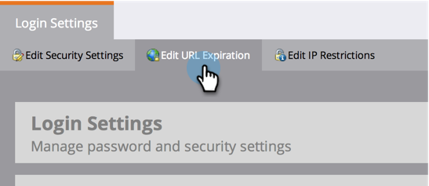

# Alterar a hora de expiração dos URLS em emails de relatório {#change-the-expiration-time-for-urls-in-report-emails}

>[!NOTE]
>
>**Permissões de administrador são necessárias**

Os links nos emails de assinatura de relatório expiram após três dias. Para alterar a hora de expiração desses links, siga estas etapas.

1. Em **[!UICONTROL Admin]**, clique em **[!UICONTROL Configurações de Logon]**.

   

1. Clique no botão **[!UICONTROL Editar expiração da URL]**.

   

1. No menu suspenso, selecione quantos dias antes do link expirar. Clique em **[!UICONTROL Salvar]**.

   

   Legal, você editou as configurações de expiração do link de email.

   >[!NOTE]
   >
   >Lembre-se de que isso se aplica somente a links em relatórios e alertas, não a emails de marketing.
