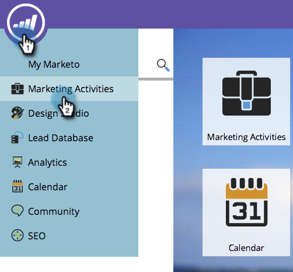

# Clonar um relatório {#clone-a-report}

Crie uma duplicata do seu relatório para personalizá-lo ainda mais sem alterar o original.

1. Vá para a área **[!UICONTROL Atividades de marketing]** (ou **[!UICONTROL Analytics]**).

   

1. Selecione seu relatório. Selecione **[!UICONTROL Ações de Relatório]** > **[!UICONTROL Clonar um Relatório]**.

   

   >[!TIP]
   >
   >Também é possível clonar um relatório clicando com o botão direito do mouse na árvore.

1. Dê um nome ao clone do seu relatório.

   

   Pronto - você está pronto para começar a personalizar seu clone!

   >[!MORELIKETHIS]
   >
   >[Filtrar Pessoas em um Relatório com uma Lista Inteligente](/help/marketo/product-docs/reporting/basic-reporting/editing-reports/filter-people-in-a-report-with-a-smart-list.md)
