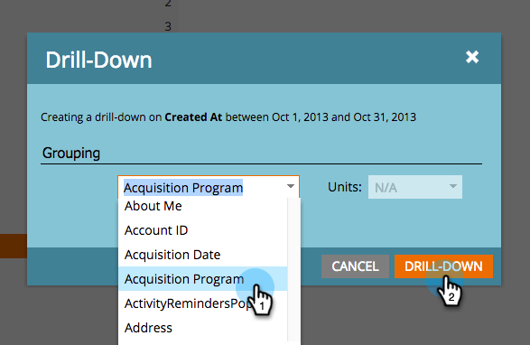

# Detalhar um Relatório de Desempenho de Pessoas {#drill-down-in-a-people-performance-report}

Detalhe um Relatório de Desempenho de Pessoas para ver informações adicionais sobre pessoas.

1. Clique na guia **[!UICONTROL Relatório]** para exibir qualquer relatório existente.

   

1. Selecione uma linha no relatório sobre a qual você deseja saber mais.

   

1. Clique em **[!UICONTROL Detalhamento]**.

   

1. Na janela pop-up **[!UICONTROL Detalhar]**, selecione o atributo que deseja detalhar. Em seguida, clique em **[!UICONTROL Detalhamento]**.

   

1. Excelente trabalho! O relatório detalhado será aberto em uma nova guia. Agora você pode explorar o novo relatório.

   >[!TIP]
   >
   >Se você não visualizar uma nova guia de relatório aberta, seu navegador pode estar bloqueando pop-ups. Altere as configurações do navegador para permitir.

   

1. Para salvar os resultados (opcional), clique no ícone **[!UICONTROL Exportar]** no canto inferior esquerdo.

   
