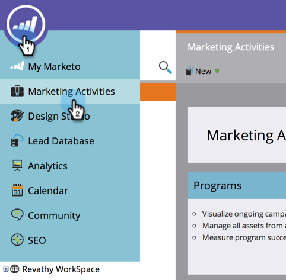
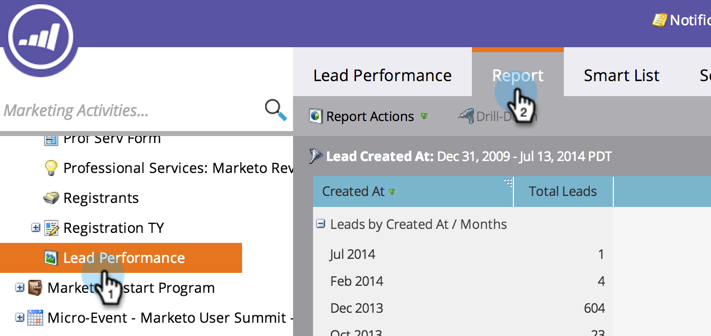

# Exportar um relatório para [!DNL Excel] {#export-a-report-to-excel}

É possível exportar qualquer relatório para um arquivo [!DNL Excel], para trabalhar com os dados em outro software.

1. Vá para a área **[!UICONTROL Atividades de marketing]**.

   

1. Selecione seu relatório na árvore de navegação e clique na guia **[!UICONTROL Relatório]**.

   

1. Clique no botão **[!UICONTROL Exportar]**.

   

   Isso é tudo! O navegador solicita que você salve o arquivo [!DNL Excel] no sistema.

   >[!MORELIKETHIS]
   >
   >Se o arquivo baixado for muito grande, você pode [alterar o tamanho do relatório](/help/marketo/product-docs/reporting/basic-reporting/editing-reports/configure-report-size.md).
