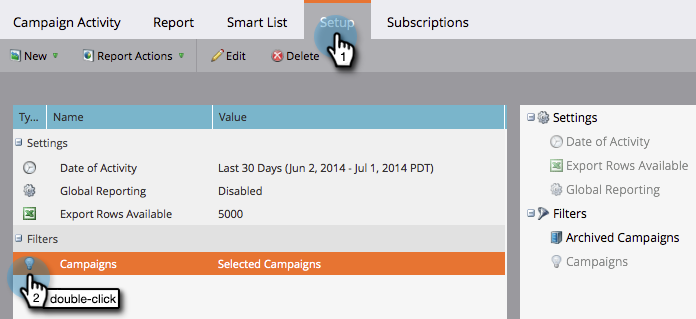

# Filtrar um relatório de atividade de campanha {#filter-a-campaign-activity-report}

Concentre seus [Relatório de atividades de campanha](/help/marketo/product-docs/reporting/basic-reporting/report-types/campaign-activity-report.md)em [campanhas inteligentes](/help/marketo/product-docs/core-marketo-concepts/smart-campaigns/creating-a-smart-campaign/understanding-batch-and-trigger-smart-campaigns.md).

1. Ir para **Atividades de marketing** (ou **Analytics**) e selecione o relatório de atividades da campanha.

   

1. Clique em **Configuração** e clique duas vezes **Campanhas**.

   

1. Escolha as pastas e campanhas inteligentes específicas a serem incluídas no seu relatório. Clique em **Aplicar**.

   

   >[!TIP]
   >
   >Se você selecionar uma pasta, seu relatório incluirá tudo o que a pasta contém no momento em que o relatório é executado.

1. Pronto! Clique em **Relatório** guia para ver _apenas_ as campanhas inteligentes selecionadas no relatório.

   

>[!MORELIKETHIS]
>
>[Relatório de desempenho de email da campanha](/help/marketo/product-docs/reporting/basic-reporting/report-types/campaign-email-performance-report.md)
