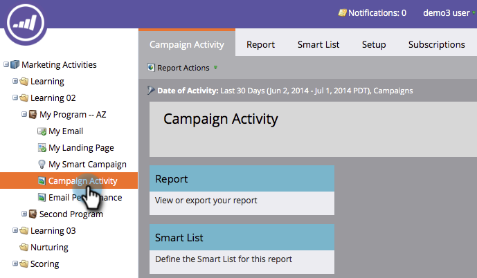

# Filtrar um relatório de atividades de campanha {#filter-a-campaign-activity-report}

Concentre seu [Relatório de atividades de campanha](/help/marketo/product-docs/reporting/basic-reporting/report-types/campaign-activity-report.md) em [campanhas inteligentes](/help/marketo/product-docs/core-marketo-concepts/smart-campaigns/creating-a-smart-campaign/understanding-batch-and-trigger-smart-campaigns.md) específicas.

>[!NOTE]
>
>A filtragem de ativos em relatórios não é compatível com o modo satélite (o ícone &quot;abrir em uma nova janela&quot; à direita da página de detalhes do ativo).

1. Vá para **Atividades de marketing** (ou **Analytics**) e selecione seu relatório de atividades de campanha.

   

1. Clique na guia **[!UICONTROL Configuração]** e clique duas vezes em **[!UICONTROL Campanhas]**.

   

1. Escolha as pastas e campanhas inteligentes específicas a serem incluídas no seu relatório. Clique em **[!UICONTROL Aplicar]**.

   

   >[!TIP]
   >
   >Se você selecionar uma pasta, seu relatório incluirá tudo o que a pasta contém no momento em que o relatório é executado.

1. Pronto! Clique na guia **[!UICONTROL Relatório]** para ver _apenas_ as campanhas inteligentes selecionadas em seu relatório.

   

>[!MORELIKETHIS]
>
>[Relatório de desempenho de email da campanha](/help/marketo/product-docs/reporting/basic-reporting/report-types/campaign-email-performance-report.md)
