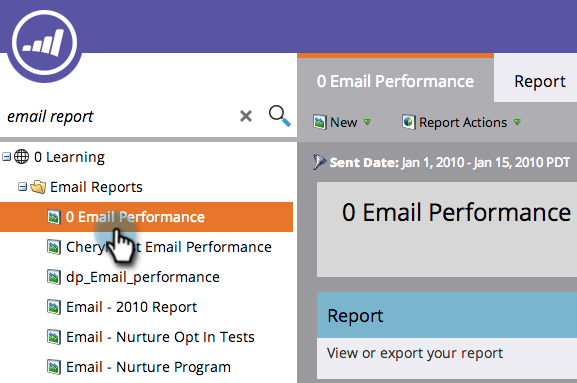

# Filtrar ativos em um relatório de email {#filter-assets-in-an-email-report}

Concentre seus [Desempenho do email](/help/marketo/product-docs/email-marketing/email-programs/email-program-data/email-performance-report.md) ou [Desempenho do link de email](/help/marketo/product-docs/email-marketing/email-programs/email-program-data/email-link-performance-report.md) relatar emails em seus programas (&#39;ativos locais&#39;), no Design Studio (&#39;ativos globais&#39;) ou naqueles que foram arquivados.

>[!NOTE]
>
>A filtragem de ativos em relatórios não é compatível com o modo satélite (o ícone &quot;abrir em uma nova janela&quot; à direita da página de detalhes do ativo).

1. Ir para **Analytics** (ou **Atividades de marketing**).

   

1. Selecione seu relatório de email.

   

1. Clique em **Configuração** e arraste sobre um filtro.

   

   * **Emails do Design Studio**: ativos globais, gerenciados no Design Studio.
   * **Emails de atividades de marketing**: ativos locais em programas na guia Atividades de marketing.
   * **Emails arquivados**: emails inativos e removidos.

1. Escolha as pastas e emails específicos a serem incluídos no relatório.

   

   >[!TIP]
   >
   >Se você selecionar uma pasta, seu relatório incluirá tudo o que a pasta contém no momento em que o relatório é executado.

1. Pronto! Clique em **Relatório** para ver o relatório filtrado.

   

>[!MORELIKETHIS]
>
>[Filtrar ativos em relatórios de email de uma campanha](/help/marketo/product-docs/reporting/basic-reporting/report-activity/filter-assets-in-a-campaign-email-reports.md)
