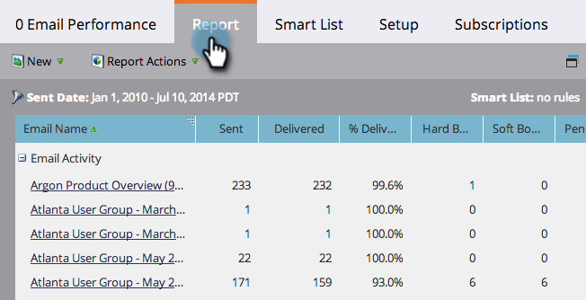

# Filtrar ativos em um relatório de email {#filter-assets-in-an-email-report}

Focalize seu relatório [Desempenho do email](../../../../product-docs/email-marketing/email-programs/email-program-data/email-performance-report.md) ou [Desempenho do link de email](../../../../product-docs/email-marketing/email-programs/email-program-data/email-link-performance-report.md) sobre emails em seus programas (&#39;ativos locais&#39;), nos relatórios do Design Studio (&#39;ativos globais&#39;) ou nos que foram arquivados.

1. Vá para a área **Analytics** (ou **Atividades de marketing**).

   

1. Selecione seu relatório de email.

   

1. Clique na guia **Configuração** e arraste sobre um filtro.

   

   * **Emails** do Design Studio: Ativos globais, gerenciados no Design Studio.
   * **Emails** das Atividades de marketing: Ativos locais em programas na guia Atividades de marketing.
   * **E-mails** arquivados: E-mails inativos e descontinuados.

1. Escolha as pastas e emails específicos a serem incluídos no seu relatório.

   

   >[!TIP]
   >
   >Se você selecionar uma pasta, seu relatório incluirá tudo o que essa pasta contém no momento em que o relatório é executado.

1. Você terminou! Clique na guia **Relatório** para ver seu relatório filtrado.

   

>[!MORELIKETHIS]
>
>* [Filtrar ativos em relatórios de e-mail de Campanha](filter-assets-in-a-campaign-email-reports.md)

>

>[!NOTE]
>
>**Mergulho profundo**
>
>Saiba tudo sobre os relatórios em [Relatórios básico](http://docs.marketo.com/display/docs/basic+reporting).

