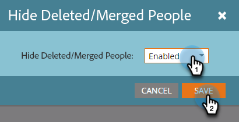

# Filtrar registros excluídos/mesclados em um relatório de desempenho de email {#filter-deleted-merged-records-in-an-email-performance-report}

Concentre seu relatório de desempenho de email em emails em seus programas (&quot;ativos locais&quot;), no Design Studio (&quot;ativos globais&quot;) ou naqueles que foram arquivados.

>[!NOTE]
>
>A filtragem de ativos em relatórios não é compatível com o modo satélite (o ícone &quot;abrir em uma nova janela&quot; à direita da página de detalhes do ativo).

1. Vá para a área **Analytics** (ou Atividades de marketing).

   

1. Selecione seu Relatório de desempenho de email.

   

1. Clique na guia **Configuração** e selecione **Ocultar Pessoas Excluídas/Mescladas**.

   

1. Clique na lista suspensa, selecione **Habilitado** e clique em **Salvar**.

   

Pronto! Clique na guia Relatório para ver o relatório filtrado.
