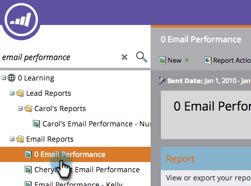

# Email De Relatório, Desempenho De Campanha Em Espaços De Trabalho {#report-email-campaign-performance-across-workspaces}

Ativar os Relatórios globais para incluir dados de toda a sua Marketo [espaços de trabalho](/help/marketo/product-docs/administration/workspaces-and-person-partitions/create-a-new-workspace.md) no seu [Desempenho do email](/help/marketo/product-docs/email-marketing/email-programs/email-program-data/email-performance-report.md) e [Desempenho do link de email](/help/marketo/product-docs/email-marketing/email-programs/email-program-data/email-link-performance-report.md) relatórios.

1. Ir para **Analytics** (ou **Atividades de marketing**).

   

1. Selecione seu relatório.

   

1. Clique em **Configuração** e clique duas vezes **Relatórios globais**.

   

1. Selecionar **Ativado**.

   

1. Isso é tudo! Clique em **Relatório** para ver dados de todos os espaços de trabalho.

   

   >[!MORELIKETHIS]
   >
   >[Filtrar ativos em um relatório de email](/help/marketo/product-docs/reporting/basic-reporting/report-activity/filter-assets-in-an-email-report.md)
