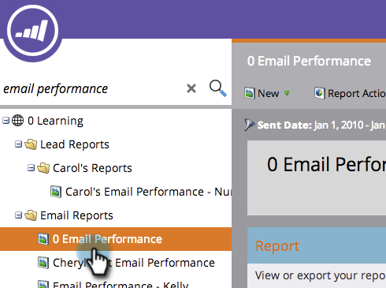

# Email de relatório, desempenho de campanha em espaços de trabalho {#report-email-campaign-performance-across-workspaces}

Ative os Relatórios Globais para incluir dados de todos os [espaços de trabalho](/help/marketo/product-docs/administration/workspaces-and-person-partitions/create-a-new-workspace.md) do Marketo nos seus relatórios de [Desempenho do Email](/help/marketo/product-docs/email-marketing/email-programs/email-program-data/email-performance-report.md) e [Desempenho do Link de Email](/help/marketo/product-docs/email-marketing/email-programs/email-program-data/email-link-performance-report.md).

1. Vá para a área **[!UICONTROL Analytics]** (ou **[!UICONTROL Atividades de marketing]**).

   

1. Selecione seu relatório.

   

1. Clique na guia **[!UICONTROL Configuração]** e clique duas vezes em **[!UICONTROL Relatórios Globais]**.

   

1. Selecione **[!UICONTROL Habilitado]**.

   

1. Isso é tudo! Clique na guia **[!UICONTROL Relatório]** para ver os dados de todos os seus espaços de trabalho.

   

   >[!MORELIKETHIS]
   >
   >[Filtrar Assets em um Relatório de Email](/help/marketo/product-docs/reporting/basic-reporting/report-activity/filter-assets-in-an-email-report.md)
