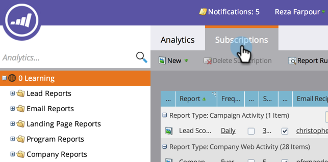

# Gerenciar assinaturas de relatório {#manage-report-subscriptions}

Configurar e excluir assinaturas de relatório.

1. Vá para a área **Analytics**.

   

1. Clique na guia **Assinaturas**.

   

   Esta página exibe as assinaturas de todos os relatórios na sua conta, agrupadas por [tipo de relatório](/help/marketo/product-docs/reporting/basic-reporting/report-types/report-type-overview.md). Isso inclui [assinaturas de relatórios básicos](/help/marketo/product-docs/reporting/basic-reporting/report-subscriptions/subscribe-to-a-basic-report.md) e de relatórios do Revenue Cycle Explorer.

   >[!TIP]
   >
   >Você também pode gerenciar assinaturas para um relatório individual em **Atividades de marketing**. Selecione o relatório e clique na guia **Assinaturas**.

   Para alterar a frequência com que um relatório é enviado por email, clique no campo Frequency e selecione uma nova opção no menu suspenso.

   

1. Para alterar os endereços de email em uma assinatura, clique no campo **Destinatários de Email** e edite os endereços de email.

   

   >[!TIP]
   >
   >* Use vírgulas entre endereços de email.
   >* Para salvar suas edições, clique em uma área _fora_ da lista de assinaturas.

   Também é possível:

   * Clique no botão **Exibir** para abrir um relatório.
   * Desmarque a caixa de seleção **Ativo** para desativar a assinatura.
   * Clique em e edite o campo **Resumo** para alterar quantas linhas de visualização aparecem no email.
   * Desmarque a caixa de seleção **Excel** para enviar resumos de relatórios sem o anexo da planilha.
   * Clique no botão **Enviar** para enviar o email do relatório imediatamente.

1. Para excluir uma assinatura completamente, selecione a linha e clique em **Excluir Assinatura**.

   

1. Confirme sua intenção de excluir a assinatura.

   

   >[!MORELIKETHIS]
   >
   >* [Assinar um Relatório Básico](/help/marketo/product-docs/reporting/basic-reporting/report-subscriptions/subscribe-to-a-basic-report.md)
   >* [Assinar um Relatório do Gerenciador de Receita](/help/marketo/product-docs/reporting/revenue-cycle-analytics/revenue-explorer/subscribe-to-a-revenue-explorer-report.md)
