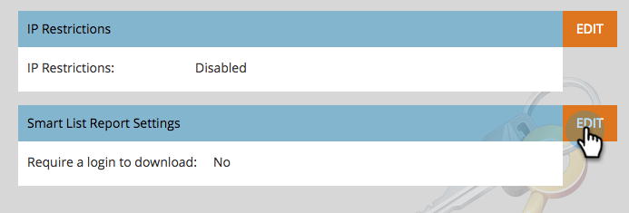

# Proteger a configuração de administração de assinatura {#secure-the-subscription-admin-setting}

>[!NOTE]
>
>**Permissões de administrador são necessárias**

Um administrador pode optar por exigir logon para visualizar um relatório.

1. Clique em **[!UICONTROL Admin]** e depois em **[!UICONTROL Configurações de Logon]**.

   

1. Clique em **[!UICONTROL Editar]** para Configurações de Relatório de Lista Inteligente.

   

1. Selecione **[!UICONTROL Sim]** para exigir um logon para baixar relatórios.

   

   >[!CAUTION]
   >
   >Quando um logon é necessário para baixar relatórios, se você não tiver acesso ao Marketo, não receberá emails de relatórios de smart list. Isso se aplica a assinaturas existentes e futuras.
