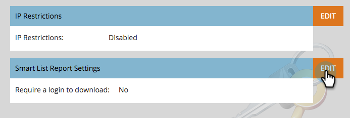

# Proteger a configuração do administrador de assinatura {#secure-the-subscription-admin-setting}

>[!NOTE]
>
>**Permissões de administrador necessárias**

Um administrador pode optar por exigir logon para visualizar um relatório.

1. Clique em **Administrador** e depois **Configurações de logon**.

   

1. Clique em **Editar** para Configurações de relatório da Smart List.

   

1. Selecionar **Sim** para solicitar um logon para baixar os relatórios.

   

   >[!CAUTION]
   >
   >Quando um logon é necessário para baixar relatórios e você não tem acesso ao Marketo, não receberá emails de relatório de lista inteligente. Isso se aplica a assinaturas existentes e futuras.
