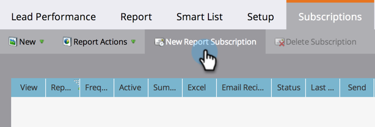

# Assine um relatório básico {#subscribe-to-a-basic-report}

Para receber atualizações automáticas de um relatório básico, ou para compartilhá-las, você pode assinar qualquer endereço de email para um relatório existente.

>[!NOTE]
>
>Para obter subscrições de relatório do Revenue Cycle Explorer, consulte [Inscrever-se em um Relatório do Revenue Explorer](/help/marketo/product-docs/reporting/revenue-cycle-analytics/revenue-explorer/subscribe-to-a-revenue-explorer-report.md).

1. Vá para a área **Atividades de marketing**.

   

1. Selecione seu relatório na árvore de navegação e clique na guia **Subscrição**.

   

   >[!NOTE]
   >
   >Você também pode assinar relatórios da guia **Analytics**.

1. Clique em **Nova Subscrição de relatório**.

   

1. Insira os endereços de email e defina a frequência dos emails do relatório.

   

   >[!NOTE]
   >
   >Qualquer pessoa pode cancelar a inscrição no relatório por email recebido.

   É isso! Verifique sua caixa de entrada!

   

   >[!MORELIKETHIS]
   >
   >Saiba como [gerenciar todas as subscrições de relatório](/help/marketo/product-docs/reporting/basic-reporting/report-subscriptions/manage-report-subscriptions.md) em um único lugar.
