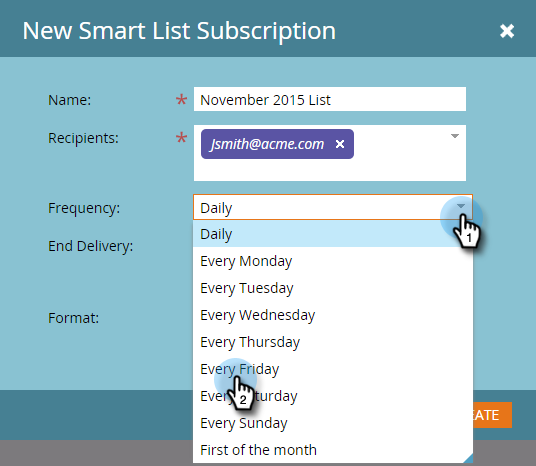
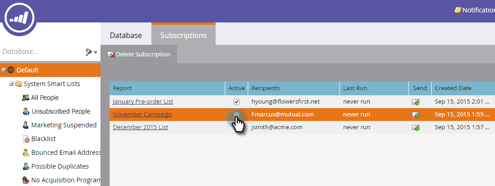
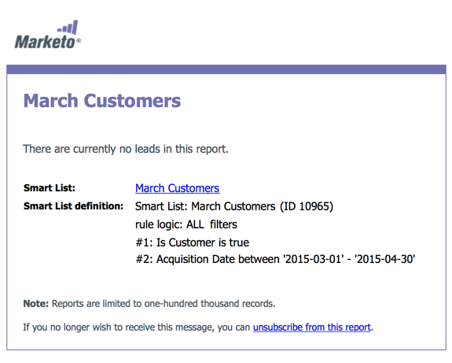

# Inscrever-se em uma lista inteligente {#subscribe-to-a-smart-list}

A inscrição em listas inteligentes é uma ótima maneira de rastrear pessoas, com relatórios enviados diretamente para sua caixa de entrada.

É possível criar uma assinatura de lista inteligente em dois lugares separados:

* Atividades de marketing
* Banco de dados

As assinaturas usam a lista completa de pessoas no momento em que são executadas.

As assinaturas ficam no local em que se encontra a sua lista inteligente, em Atividades de marketing ou Banco de dados.

É possível criar várias assinaturas a partir da mesma lista inteligente.

As assinaturas são específicas do espaço de trabalho. Por exemplo, essa lista de assinaturas está em um espaço de trabalho diferente daqueles mostrados no restante deste artigo:

>[!NOTE]
>
>Você está limitado a 100 assinaturas e a um máximo de 100.000 pessoas por assinatura, em espaços de trabalho e por instância do Marketo. Se a lista inteligente contiver mais de 100.000 nomes, o Marketo executará a assinatura para os primeiros 100.000.

## Criar uma assinatura de lista inteligente {#create-a-smart-list-subscription}

1. Vá para o **Banco de Dados** ou **Atividades de Marketing**.

   

1. Selecione a lista inteligente para a qual deseja criar uma assinatura. Clique em **Listar Ações** e selecione **Nova Assinatura da Smart List**.

   

1. Dê um **Nome** à sua assinatura e selecione ou insira os endereços de email dos **Destinatários**.

   

1. Clique na lista **Frequência** e selecione uma frequência.

   

1. Defina a data de **Término da Entrega**. Você pode selecionar **Nunca** ou uma data de calendário.

   

1. Clique em **Formatar** e escolha na lista.

   

1. Clique em **Criar**.

   

1. A nova assinatura da lista inteligente é exibida na parte superior da lista na guia Subscriptions. Clique em **Enviar** se desejar enviar agora e não aguardar a entrega agendada de email.

   

1. Recomendamos que você desmarque a caixa de seleção Ativo para desativar uma assinatura de lista inteligente se ninguém estiver inscrito nela.

   

   Isso foi fácil, não foi?

## Mensagem de email {#email-message}

Os recipients receberão um email com uma opção para baixar o relatório, bem como um link diretamente para a lista na instância do Marketo. O link de download expira em quatro dias.

>[!NOTE]
>
>Se a configuração [Administrador de Assinatura Segura](/help/marketo/product-docs/reporting/basic-reporting/report-subscriptions/secure-the-subscription-admin-setting.md) estiver definida como **Sim**, somente as pessoas com acesso à instância do Marketo poderão baixar o relatório.

Se um relatório tiver 0 pessoas, os recipients ainda receberão um email. No entanto, o email simplesmente declara que não há pessoas para relatar.

>[!NOTE]
>
>Quando você modifica um filtro de lista inteligente no qual uma assinatura foi baseada, ele também atualiza o relatório.

O email também fornece informações adicionais sobre os filtros usados para criar a lista.

## Excluir uma assinatura {#delete-a-subscription}

Para excluir uma subscrição, selecione-a na guia subscriptions e clique em Delete Subscription.

>[!MORELIKETHIS]
>
>* [Editar uma Assinatura de Smart List](/help/marketo/product-docs/reporting/basic-reporting/report-subscriptions/edit-a-smart-list-subscription.md)
>* [Proteger a Configuração de Administrador da Assinatura](/help/marketo/product-docs/reporting/basic-reporting/report-subscriptions/secure-the-subscription-admin-setting.md)
